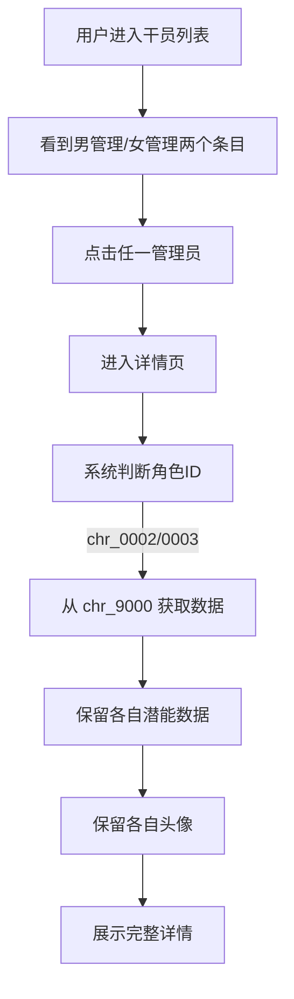

# 管理员干员数据映射特化

**功能名称**: 管理员干员数据映射
**PRD 版本**: v1.0
**创建日期**: 2026-07-25
**作者**: MiMoCode

## 背景与目标

### 1.1 背景

在《明日方舟：终末地》游戏中，管理员角色（男管理/女管理）存在特殊的数据结构：

- **展示角色**: `chr_0002_endminm`（男管理）和 `chr_0003_endminf`（女管理）是用于界面展示的干员
- **结算角色**: `chr_9000_endmin` 是游戏数据结算时实际使用的角色数据

当前档案馆系统中，`chr_0002_endminm` 和 `chr_0003_endminf` 展示的是各自独立的数据，这与游戏实际数据映射关系不一致。

### 1.2 目标

1. 建立正确的数据映射关系，使档案馆展示与游戏实际数据一致
2. 保持管理员干员的个性化展示（潜能、头像）
3. 为后续可能的类似映射需求提供参考模式

### 1.3 成功标准

- 管理员干员详情页展示的数据与游戏内 `chr_9000_endmin` 一致
- 潜能和干员头像仍使用 `chr_0002/0003` 各自的数据
- 用户在列表中仍能看到两个独立的管理员条目
- 所有数据加载和展示无性能回退

## 用户分析

### 2.1 目标用户

- 《明日方舟：终末地》玩家
- 希望查看管理员干员详细数据的用户
- 需要参考管理员技能、天赋等信息进行游戏决策的用户

### 2.2 用户场景

| 场景 | 用户角色 | 目标 | 痛点 |
|------|---------|------|------|
| 查看管理员技能信息 | 普通玩家 | 了解管理员的技能机制和效果 | 当前显示的数据与游戏内不一致 |
| 查看管理员天赋效果 | 进阶玩家 | 分析管理员的天赋加成 | 数据来源不明确 |
| 比较不同性别管理员 | 决策型玩家 | 选择使用男管理还是女管理 | 两者数据显示差异不合理 |

## 功能需求

### 3.1 功能概述

将管理员干员（`chr_0002_endminm` 和 `chr_0003_endminf`）的数据源进行特化处理：除「潜能」和「干员头像」外，其他数据统一使用 `chr_9000_endmin` 的数据。

### 3.2 功能列表

#### 功能点 1: 数据源映射
- **描述**: 当用户访问 `chr_0002_endminm` 或 `chr_0003_endminf` 的详情页时，系统自动从 `chr_9000_endmin` 获取除潜能和头像外的所有数据
- **用户价值**: 确保展示数据与游戏实际数据一致，提供准确的参考信息
- **验收标准**:
  - [ ] 基础信息（名称、职业、元素等）显示 `chr_9000` 数据
  - [ ] 技能信息（技能组、技能描述）显示 `chr_9000` 数据
  - [ ] 天赋信息显示 `chr_9000` 数据
  - [ ] 突破信息（精英化、属性提升）显示 `chr_9000` 数据
  - [ ] 能力值（属性数据）显示 `chr_9000` 数据
  - [ ] 档案记录（语音、档案）显示 `chr_9000` 数据
  - [ ] 装备推荐显示 `chr_9000` 数据
  - [ ] 后勤技能显示 `chr_9000` 数据

#### 功能点 2: 潜能数据保留
- **描述**: 潜能部分保持使用 `chr_0002_endminm` 或 `chr_0003_endminf` 各自的潜能数据
- **用户价值**: 潜能是角色个性化的重要体现，保持各自独立
- **验收标准**:
  - [ ] 男管理显示 `chr_0002_endminm` 的潜能数据
  - [ ] 女管理显示 `chr_0003_endminf` 的潜能数据

#### 功能点 3: 干员头像保留
- **描述**: 干员头像（列表卡片和详情页头像）保持使用 `chr_0002_endminm` 或 `chr_0003_endminf` 各自的头像资源
- **用户价值**: 保持角色外观的个性化展示
- **验收标准**:
  - [ ] 列表卡片显示各自角色的头像
  - [ ] 详情页头像显示各自角色的头像

#### 功能点 4: 列表展示保持独立
- **描述**: 在干员列表页面，男管理和女管理仍然作为两个独立的条目展示
- **用户价值**: 用户可以分别查看和选择不同性别的管理员
- **验收标准**:
  - [ ] 列表中显示两个管理员条目
  - [ ] 点击各自条目进入对应的详情页

#### 功能点 5: 详情页标题
- **描述**: 详情页标题使用 `chr_9000_endmin` 的名称
- **用户价值**: 统一展示管理员的实际名称
- **验收标准**:
  - [ ] 详情页标题显示 `chr_9000_endmin` 的名称

### 3.3 用户操作流程

### 3.4 页面/界面描述

| 页面 | 描述 | 关键元素 |
|------|------|---------|
| 干员列表 | 展示所有干员的卡片列表 | 管理员卡片显示各自头像 |
| 干员详情 | 展示单个干员的详细信息 | 标题、技能、天赋、突破、潜能、后勤、装备、档案、语音 |

### 3.5 异常与边界情况

| 情况 | 预期行为 |
|------|---------|
| `chr_9000_endmin` 数据不存在 | 降级显示 `chr_0002/0003` 自身数据，显示错误提示 |
| `chr_9000_endmin` 数据加载失败 | 降级显示 `chr_0002/0003` 自身数据，显示错误提示 |
| 潜能数据不存在 | 显示空潜能区域 |
| 头像资源加载失败 | 显示默认占位图 |

## 四、非功能需求

### 4.1 性能要求

- 数据加载不应产生额外的网络请求（应利用现有缓存机制）
- 详情页加载时间不应明显增加

### 4.2 安全性要求

无特殊安全要求

### 4.3 兼容性要求

- 与现有干员数据展示功能完全兼容
- 不影响其他干员的正常展示

## 五、依赖与约束

### 5.1 依赖

- `chr_9000_endmin` 数据必须存在于 CharacterTable 中
- 现有的数据缓存机制（内存缓存 + IndexedDB）

### 5.2 约束

- 数据映射逻辑需在适配层（adapter）或数据获取层（hooks）实现
- 不修改原始数据结构

## 六、相关文档

- [数据表映射参考](docs/engineering/references/data-mapping-tables.md)
- [前端开发规范](docs/engineering/frontend-spec.md)
