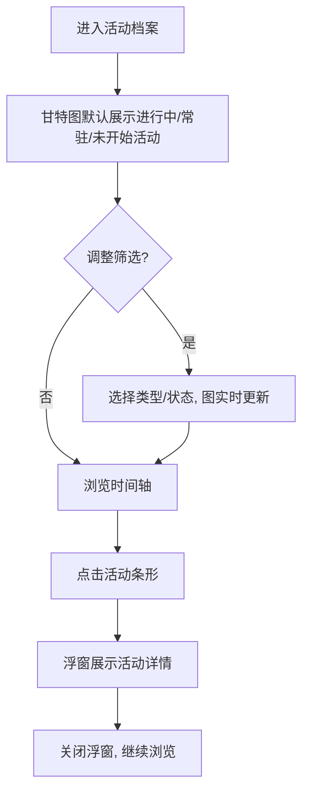

# 活动档案

活动档案收录塔卫二上曾经发生与即将发生的各项活动，以编年长卷的形式铺陈在时间轴上，管理员可一览活动的起止与状态，并翻阅单个活动的卷宗摘要。

**PRD 版本**: v1.0
**创建日期**: 2026-07-26

## 背景与目标

### 背景

游戏内活动种类繁多（签到、挑战、角色试用、回流、版本引导等），且随版本更替不断上下线。管理员当前无法在站内查阅活动的排期与内容，难以回答「最近有什么活动」「某个活动什么时候结束」这类问题。

### 目标

- 以一张甘特图完整呈现所有活动的时间排布，当前进行中的活动一眼可辨。
- 支持按活动类型与活动状态筛选，快速聚焦关心的活动。
- 点击任意活动即可查看其名称、时间、类型、描述等详细信息。

### 成功标准

- 站内可查阅游戏数据中全部活动（当前 84 个），无遗漏。
- 活动的开启/结束时间与游戏内实际排期一致。
- 任意活动均可通过点击查看详情，筛选组合下结果正确。

## 用户分析

### 目标用户

- 普通管理员（玩家）：想了解当前与近期的活动排期，规划游戏时间。
- 资料查阅者：想回顾历史活动或确认某个活动的具体时间。

### 用户场景

| 场景 | 用户角色 | 目标 | 痛点 |
|------|----------|------|------|
| 规划本周游戏时间 | 普通管理员 | 看当前进行中与即将开始的活动 | 游戏外无统一的排期查询入口 |
| 回顾历史活动 | 资料查阅者 | 查某个过往活动的起止时间 | 活动结束后游戏内入口关闭，无从查证 |
| 定位特定类型活动 | 普通管理员 | 只看签到类或挑战类活动 | 活动数量多，逐一辨认成本高 |

## 功能需求

### 功能概述

新增「活动档案」模块：以甘特图形式将所有活动排布在时间轴上，上方提供活动类型与活动状态筛选，点击活动弹出浮窗展示活动详情。

### 功能列表

#### 功能点 1: 活动编年甘特图

- **描述**: 以甘特图形式展示全部活动。每一行是一个活动，横轴为时间，活动以条形（bar）呈现，条的左右端点对应活动的开启与结束时间。时间轴上标出「今天」的位置。常驻活动（无结束时间）的条形以开放末端（如箭头或渐变）表示。
- **用户价值**: 活动排期一目了然，活动之间的先后、重叠关系直观可见。
- **验收标准**:
  - [ ] 所有具备时间信息的活动都出现在图中，位置与起止时间对应正确。
  - [ ] 时间轴带有月份/日期刻度，且标注今日线。
  - [ ] 常驻活动的条形与普通活动可区分。
  - [ ] 同一活动存在多个开启时段时，各时段均有体现（同行多条或在详情中列出）。

#### 功能点 2: 活动类型与状态筛选

- **描述**: 甘特图上方提供两组筛选：
  - **活动类型**：将游戏中的数十种活动归并为语义化大类（签到、挑战、角色试用、福利奖励、回流、引导、其他），支持多选或单选。
  - **活动状态**：进行中 / 未开始 / 常驻 / 已结束，支持多选。
- **用户价值**: 在海量活动中快速聚焦关心的范围。
- **验收标准**:
  - [ ] 两组筛选可独立或组合使用，甘特图实时更新。
  - [ ] 默认勾选「进行中」「常驻」「未开始」，即默认视图聚焦当前与近期活动。
  - [ ] 筛选后无匹配活动时，展示空态提示。

#### 功能点 3: 活动详情浮窗

- **描述**: 点击甘特图中的活动条形，弹出浮窗展示活动详情：活动主视觉图、名称、类型、状态、开启/结束时间（多个时段全部列出）、活动描述（富文本正常解析）、活动标签。
- **用户价值**: 不离开编年视图即可查阅活动卷宗摘要。
- **验收标准**:
  - [ ] 点击任意活动条形均可打开浮窗，内容与该活动对应。
  - [ ] 点击浮窗外区域或关闭按钮可关闭浮窗。
  - [ ] 描述中的富文本（颜色、加粗等）正常渲染。

### 用户操作流程

### 页面/界面描述

| 页面 | 描述 | 关键元素 |
|------|------|---------|
| 活动编年页 | 活动档案主页面 | 类型筛选、状态筛选、甘特图（时间刻度、今日线、活动条形）、活动详情浮窗 |

### 状态与类型定义

活动状态按当前时间与活动时段的关系判定：

| 状态 | 判定规则 |
|------|---------|
| 进行中 | 当前时间处于活动任一时段的开启与结束之间 |
| 未开始 | 活动所有时段均尚未开启 |
| 常驻 | 活动无结束时间 |
| 已结束 | 活动所有时段均已结束 |

活动类型归并为大类展示，游戏数据中新出现的类型自动归入「其他」，不产生残缺或报错。

### 异常与边界情况

| 情况 | 预期行为 |
|------|---------|
| 活动缺少时间信息 | 不出现在甘特图中，并在详情可用时标注时间未知 |
| 活动描述为空 | 浮窗中不展示描述区块 |
| 时间跨度过大（历史到未来跨度数年） | 甘特图支持横向滚动，默认视图聚焦当前时段附近 |
| 筛选后无结果 | 展示空态提示，引导用户放宽筛选 |

## 非功能需求

### 性能要求

- 活动数据量约百级，甘特图渲染与筛选响应应流畅，无明显卡顿。
- 数据遵循站内统一的缓存与版本失效机制，游戏版本更新后活动数据随之刷新。

### 兼容性要求

- 与其他档案模块一致，支持桌面与移动端浏览；移动端下甘特图可横向滑动。

## 依赖与约束

### 依赖

- 游戏活动数据（活动主表、活动时间表、活动标签表）可由站点现有数据渠道获取。

### 约束

- 视觉风格与交互模式与站内现有档案模块保持一致（暗色档案风格、浮窗交互）。
- 全部界面文案支持站内已有的 14 种语言。

## 相关文档

- [[20260719-site-concept|站点概念设计]]
- [[20260719-updates|更新编年]]
- [[20260719-weapon-archive|武器档案]]
