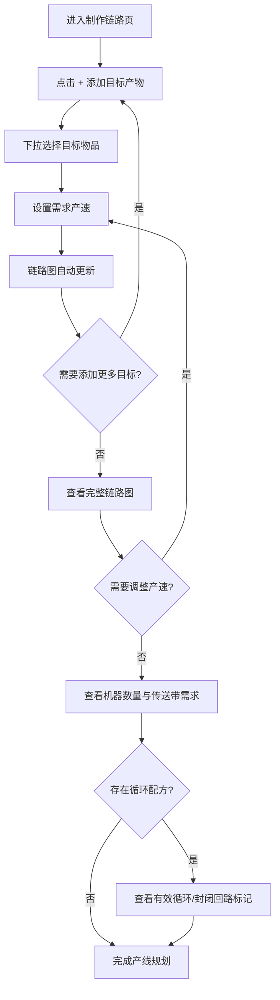

# 制作链路图重构（二期）

**功能名称**: 制作链路图 v2
**关联一期 PRD**: [[20260725-factory-system|工厂系统（工厂配方与制作链路）]]
**PRD 版本**: v1.0
**创建日期**: 2026-07-26
**作者**: 产品

## 背景与目标

### 1.1 背景

一期制作链路已上线基础功能：选择目标产物、DFS 展开至采集源、ReactFlow 渲染图、循环依赖标记。验收后发现以下核心问题：

1. **图结构不合理**：以物品节点为中心，机器信息分散，无法直观看到「需要多少台什么机器」；
2. **速率计算不完整**：仅按配方理论产出计算，未考虑上游供应瓶颈，无法回答「实际能产多少」；
3. **循环处理过于简单**：一律标记 `isCycle: true` 并跳过，无法区分有效循环（净产出 > 0）和封闭回路（净产出 ≤ 0）；
4. **缺少物流设施**：机器之间的传送带与管道信息完全缺失，无法规划物流；
5. **交互效率低**：左侧列表选择目标产物效率低，无法调整目标产速，无法精确控制。

### 1.2 目标

- 图结构改为**以机器节点为中心**，每个节点显示机器名称、数量、配方摘要与物流需求；
- 支持**多目标产物 + 可调产速**，所有目标在同一张图内合并求解；
- 显示**传送带/管道数量**与吞吐量，区分固体与液体传输；
- 完善**循环规则**：区分有效循环与封闭回路，支持副产物隔离与外部供应打断；
- **供应瓶颈计算**：实际产出 = min(理论产出, 上游实际供应量)；
- 物流数据从游戏 API 动态读取，禁止硬编码。

### 1.3 成功标准

- 用户可选择多个目标产物并设置各自的产速，链路图实时更新；
- 每个机器节点清晰显示：机器名称、所需台数、配方摘要（输入→产出×数量）、总产出速率；
- 每条边清晰显示：传输物品、传送带/管道数量、总吞吐量，固体金色实线/液体蓝色虚线自动区分；
- 循环配方（如瓶装/倒空、采种/种植）正确区分有效循环与封闭回路，视觉标记明确；
- 产速变化时机器数量与传送带数量联动更新。

## 用户分析

### 2.1 目标用户

- **核心用户**：规划工厂产线、计算物料平衡的深度玩家，需要精确的机器台数与传送带数量。
- **次要用户**：查询制作链路概览的资料型用户。

### 2.2 用户场景

| 场景 | 用户角色 | 目标 | 痛点 |
|------|----------|------|------|
| 产线规划 | 核心玩家 | 选定目标产物与产速，查看需要多少台机器、几条传送带 | 一期图中缺少机器数量与传送带信息 |
| 多产物规划 | 核心玩家 | 同时规划多个产物的产线，查看共享中间品的影响 | 一期仅支持单目标，无法合并求解 |
| 循环配方分析 | 核心玩家 | 分析瓶装/倒空等循环配方的净产出 | 一期循环一律跳过，无法区分有效循环和封闭回路 |
| 物流规划 | 核心玩家 | 计算传送带与管道的需求数量 | 一期完全缺失物流设施信息 |

## 功能需求

### 3.1 功能概述

制作链路图 v2 重构链路图的核心逻辑与交互，以机器节点为中心展示完整产线信息，支持多目标产物与可调产速，新增物流设施（传送带/管道）展示，完善循环处理规则。

### 3.2 功能列表

#### 功能点 1: 多目标产物选择与产速设置

- **描述**: 页面顶部提供目标产物选择区，支持添加多个目标产物。每个目标产物可独立设置需求产速（个/min），允许非整数。选择后自动填入配方默认产速，用户可修改。支持删除单个目标和清空全部目标。选择状态通过 URL 参数同步（`?targets=xxx:6,yyy:3.5`），刷新后保持。
- **用户价值**: 精确控制每个目标的产出速率，多目标可在同一张图内查看共享中间品的影响。
- **验收标准**:
  - [ ] 支持添加多个目标产物，每个可独立设置产速
  - [ ] 产速允许非整数，默认值为配方理论产出
  - [ ] 产速变化时链路图实时更新
  - [ ] URL 参数同步，刷新后还原
  - [ ] 支持单个删除和清空全部

#### 功能点 2: 以机器节点为中心的链路图

- **描述**: 图结构改为以机器节点为中心。每个机器节点显示：机器图标与名称、所需台数（×N）、配方摘要（输入物品→输出物品×数量）、总产出速率。节点内的所有信息按配方实际数据计算。
- **用户价值**: 一眼看清每种机器需要多少台、产出多少，直接回答「做这个需要什么机器、几台」。
- **验收标准**:
  - [ ] 图中节点以机器为中心，每个节点显示完整机器信息
  - [ ] 机器台数 = ceil(实际产出 / 理论产出)
  - [ ] 配方摘要清晰展示输入→输出与数量
  - [ ] 总产出速率 = 机器台数 × 单台理论产出

#### 功能点 3: 传送带与管道展示

- **描述**: 机器之间的连线代表物流设施，显示传送带或管道的数量与总吞吐量。固体传输使用金色实线，液体传输使用蓝色虚线。每条边标注：传输物品、传送带/管道数量、总吞吐量（个/min 或 单位/min）。吞吐量从游戏 API 动态计算（传送带 30 个/min，管道 120 单位/min）。
- **用户价值**: 直接看清物流规划需要几条传送带或管道，区分固体与液体传输。
- **验收标准**:
  - [ ] 固体传输边为金色实线 + 方向箭头
  - [ ] 液体传输边为蓝色虚线 + 方向箭头
  - [ ] 每条边标注传送带/管道数量与吞吐量
  - [ ] 数量 = ceil(实际传输速率 / 单条吞吐量)

#### 功能点 4: 循环规则完善

- **描述**: 完善循环依赖的处理规则：
  - **净产出判定**：计算循环中回传物品的净产出（产出 - 消耗）。净产出 > 0 为有效循环（继续展开上游），≤ 0 为封闭回路（停止展开，特殊视觉标记）。
  - **副产物隔离**：多产出配方中，只有参与循环的产出参与判定，其他作为副产物独立显示。
  - **外部供应优先**：循环中某物品有外部供应（如矿机），在该点打断循环。
  - **自消费防护**：配方消费自己产出且无外部供应时标记为异常。
  - **深度限制**：最大循环检测深度 10 层。
- **用户价值**: 准确理解循环配方的净产出，区分「这个循环有盈余」和「这个循环是封闭的」。
- **验收标准**:
  - [ ] 封闭回路（净产出 ≤ 0）使用橙色虚线 + "↻ 封闭" 标记
  - [ ] 有效循环（净产出 > 0）使用金色实线 + 产出数量标注
  - [ ] 副产物在节点内独立列出
  - [ ] 有外部供应的循环在供应点终止

#### 功能点 5: 供应瓶颈计算

- **描述**: 节点的实际产出 = min(配方理论产出, 上游实际供应量按配方折算)。当上游供应不足时，当前节点产出按实际供应量结算，机器数量也相应减少。
- **用户价值**: 精确反映实际产能，不虚报理论值。
- **验收标准**:
  - [ ] 供应充足时满产，供应不足时按比例减产
  - [ ] 机器数量 = ceil(实际产出 / 理论产出)
  - [ ] 多级供应链逐级正确结算

### 3.3 用户操作流程

### 3.4 页面/界面描述

| 页面 | 描述 | 关键元素 |
|------|------|----------|
| 制作链路 v2 | 顶部多目标选择 + 全宽链路图 | 目标产物下拉选择器、产速输入框、删除按钮、添加按钮、链路图（机器节点、传送带/管道边、循环标记） |

### 3.5 异常与边界情况

| 情况 | 预期行为 |
|------|----------|
| 目标产速设为 0 | 无节点展示 |
| 产速极大导致机器数量极多 | 正常显示数值，图可缩放查看 |
| 液体物品 ID 前缀判断不准 | 以 `liquid_`/`acid`/`water`/`oil` 等为液体，其余为固体 |
| 深度超过 10 层的链路 | 停止展开，标记为截断 |
| 多目标共享中间品 | 中间品节点机器数量取所有目标需求的最大值 |

## 四、非功能需求

### 4.1 性能要求

- 链路图在常规规模（数十个节点）下渲染与交互流畅。
- 产速变化时链路重算延迟 < 200ms。

### 4.2 安全性要求

- 无。

### 4.3 兼容性要求

- 桌面与移动端浏览器均可用：链路图支持触摸平移缩放。
- 移动端目标选择器适配窄屏布局。

## 五、依赖与约束

### 5.1 依赖

- 一期工厂系统框架（路由、数据层、物品组件）。
- 游戏 API 数据表：`FactoryGridBeltTable`、`FactoryLiquidPipeTable`（物流设施数据）。
- `@xyflow/react` + `@dagrejs/dagre`（图渲染与布局）。

### 5.2 约束

- 物流设施吞吐量从游戏 API 动态读取，禁止硬编码。
- 本期仅支持机器制造配方的链路推演，不涉及手工/枢纽/飞船配方。
- 循环检测深度限制 10 层。

## 六、相关文档

- [[20260725-factory-system|工厂系统 PRD（一期）]]
- [[20260726-factory-chain-v2-tech|制作链路图 v2 技术方案]]
- [[20260726-factory-chain-v2-plan|制作链路图 v2 实现方案]]
