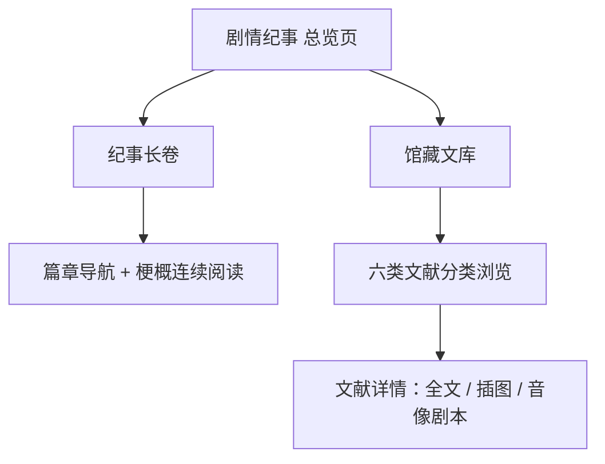

# 剧情纪事

**功能名称**: 剧情纪事（Story Chronicle）——「大事记 · 剧情记录」模块重构
**PRD 版本**: v1.0
**创建日期**: 2026-07-30
**作者**: 产品

## 背景与目标

### 1.1 背景

当前「大事记」分组下的「剧情记录」模块（`/archive/story`）仅为占位实现：一个只有标题的文献卡片网格，没有正文、没有分类、没有详情页。管理员无法通过它了解任何剧情内容，模块名「剧情记录」也与实际内容（仅 PRTS 文献索引）不符。

与此同时，游戏数据中其实存在完整的叙事资料体系，目前完全未被利用：

- **剧情回顾**：游戏内为每一场剧情对话提供了一段官方「剧情梗概」（共 1000+ 段），按任务与场次组织，是快速通览主线与支线剧情的最佳载体。
- **PRTS 文库**：游戏内 PRTS 系统收录了 460+ 条世界观文献，分为中枢档案、纸质记录、电子档案、藏品、调查报告、多媒体六大类，每条均有完整正文（含插图）或音像剧本。

### 1.2 目标

将「剧情记录」重构为「剧情纪事」模块，让管理员能够**清晰、快速**地了解《终末地》的剧情：

- 以「纪事长卷」呈现官方剧情梗概，支持按篇章连续阅读，无需进入游戏即可通览故事全貌。
- 以「馆藏文库」完整收录 PRTS 六类文献，支持分类浏览与全文阅读。
- 从模块名称、内容组织到整体视觉完成重构，与档案馆「准确、结构化、可追溯、官方感」的气质一致。

### 1.3 成功标准

- 管理员从模块入口出发，2 次点击内可达任意一段剧情梗概或任意一篇文献全文。
- 剧情梗概按篇章有序呈现，可连续通读；文献按官方六类组织，计数准确。
- 所有文本跟随全局语言切换正确显示；正文中的插图正常加载。
- 全部 1000+ 段剧情梗概与 460+ 条文库条目可被浏览，无遗漏、无重复。

## 用户分析

### 2.1 目标用户

- **剧情党玩家**：想快速补完或回顾《终末地》剧情，不愿在游戏内逐场回放。
- **设定研究者**：需要查阅世界观文献（历史事件、势力、风物）原文进行考据。
- **内容编辑者**：需要可引用的、结构化的剧情文本来源。

### 2.2 用户场景

| 场景 | 用户角色 | 目标 | 痛点 |
|--|--|--|--|
| 快速补剧情 | 剧情党玩家 | 按顺序读完主线每一章的故事梗概 | 游戏内只能逐场回放，耗时；现有模块无内容 |
| 回查某段剧情 | 剧情党玩家 | 找到特定篇章的某场戏讲了什么 | 无检索入口，记忆模糊时无从找起 |
| 查阅世界观文献 | 设定研究者 | 通读某一类文献（如调查报告、纸质记录）全文 | 现有模块只有标题列表，无正文 |
| 引用原始文本 | 内容编辑者 | 获得文献的准确原文与出处编号 | 文本分散，无稳定编号可引用 |

## 功能需求

### 3.1 功能概述

将 `/archive/story` 重构为「剧情纪事」模块，包含一个总览页与两大内容板块：「纪事长卷」（剧情梗概连续阅读）与「馆藏文库」（PRTS 文献分类浏览与全文阅读）。

### 3.2 命名重构

| 项目 | 现状 | 重构后 |
|------|------|--------|
| 模块名 | 剧情记录 | **剧情纪事** |
| 板块一 | —（不存在） | **纪事长卷**：剧情梗概连续阅读 |
| 板块二 | —（文献标题列表） | **馆藏文库**：PRTS 六类文献 |

命名理由：「纪事」呼应所在分组「大事记」（chronicle），点明模块叙事属性；「长卷」传达连续通读的体验；「馆藏文库」呼应档案馆设定，且六类文献本身即游戏内 PRTS 系统的馆藏分类。

### 3.3 功能列表

#### 功能点 1: 剧情纪事总览页

- **描述**: 模块首页。顶部为模块题名「剧情纪事」与一句话定位；主体为两个板块入口卡片——「纪事长卷」与「馆藏文库」，各配代表性图标、内容计数与一句话说明。
- **用户价值**: 一眼理解模块结构，直接进入目标板块。
- **验收标准**:
  - [ ] 页面展示模块名「剧情纪事」、档案编号（HSA-STY）与定位文案。
  - [ ] 两个入口卡片分别展示剧情梗概段数、文库条目数的真实计数。
  - [ ] 点击入口卡片进入对应板块。

#### 功能点 2: 纪事长卷（剧情回顾连续阅读）

- **描述**: 将游戏内官方「剧情梗概」按篇章组织为可连续通读的长卷。页面左侧（移动端为顶部折叠）为篇章导航，按「篇章 → 任务」两级组织；右侧为梗概流，每张卡片为一场戏的梗概，卡片带档案馆式编号（如「E1·M3·场04」）作为稳定引用。支持按篇章类型筛选（如主线、支线、干员故事等）。
- **用户价值**: 不进入游戏即可按顺序补完整个故事；编号体系让每一段剧情可被精确引用。
- **验收标准**:
  - [ ] 全部剧情梗概按篇章、任务、场次顺序完整呈现，顺序与游戏内一致。
  - [ ] 篇章导航点击后滚动定位到对应任务的第一场。
  - [ ] 可按篇章类型筛选，筛选后梗概流仅展示对应类型。
  - [ ] 每张梗概卡片展示唯一编号与梗概全文。
  - [ ] 空篇章、缺场次等数据缺口不导致页面报错。

#### 功能点 3: 馆藏文库（PRTS 文献分类浏览）

- **描述**: 完整收录游戏内 PRTS 系统的六类文献：中枢档案、纸质记录、电子档案、藏品、调查报告、多媒体。页面顶部为六类页签（带各类条目计数），页签下为文献分组卡片网格——游戏内将同类文献组织为若干「卷」（如《定居地全貌》），每张卡片展示卷图标、卷名、副题与收录条目数。点击卷卡片展开（或进入）该卷的条目列表。
- **用户价值**: 以游戏原生分类体系浏览全部世界观文献，结构清晰、无遗漏。
- **验收标准**:
  - [ ] 六个分类页签与游戏内 PRTS 分类一致，展示各类条目计数。
  - [ ] 卷卡片展示图标、卷名、副题（如有）、条目数。
  - [ ] 卷内条目按游戏内顺序排列。
  - [ ] 无图标的卷使用占位图形，不破版。

#### 功能点 4: 文献详情页

- **描述**: 文献条目全文页。展示条目标题、所属卷与分类、档案馆编号、简介（如有）与完整正文。正文保留游戏内排版（颜色、加粗、换行）与插图。多媒体类条目以剧本形式呈现：逐条展示说话人与台词。条目内容来自多篇连续文本时按顺序完整呈现。
- **用户价值**: 获得文献的准确全文，可读、可引用。
- **验收标准**:
  - [ ] 正文富文本（颜色、加粗、换行）正确渲染，插图正常加载。
  - [ ] 多媒体条目以「说话人 + 台词」的剧本形式逐条呈现。
  - [ ] 页面提供返回所属卷/分类的导航。
  - [ ] 正文缺失或图片加载失败时展示占位提示，不白屏。

#### 功能点 5: 站点导航与入口更新

- **描述**: 侧边导航与档案馆首页中「剧情记录」更名为「剧情纪事」，描述文案同步更新；面包屑名称同步。
- **用户价值**: 全站命名一致，入口语义准确。
- **验收标准**:
  - [ ] 侧边导航、档案馆首页卡片、面包屑均显示「剧情纪事」及新描述。
  - [ ] 全部 14 种语言的导航文案正确显示。

### 3.4 用户操作流程

### 3.5 页面/界面描述

整体视觉延续档案馆设计体系：深墨底色、象牙白正文、暗金点缀、衬线题名、等宽档案编号。本模块引入「长卷」意象：梗概卡片以左侧细金线串联，模拟卷轴装订线，阅读顺序一目了然。

| 页面 | 描述 | 关键元素 |
|------|------|---------|
| 总览页 | 模块门面，双板块引导 | 衬线大题名「剧情纪事」、档案编号、两张板块入口卡（图标 + 计数 + 说明） |
| 纪事长卷 | 剧情梗概连续阅读 | 篇章导航（篇章 → 任务两级）、类型筛选、梗概流卡片（编号 + 正文，金线串联） |
| 馆藏文库 | 六类文献浏览 | 分类页签（带计数）、卷卡片网格（图标 + 卷名 + 副题 + 条目数） |
| 文献详情 | 文献全文阅读 | 标题、所属卷/分类、档案编号、富文本正文、插图、音像剧本（说话人 + 台词） |

### 3.6 异常与边界情况

| 情况 | 预期行为 |
|------|---------|
| 数据加载中 | 展示骨架屏，与全站三态模式一致 |
| 数据加载失败 | 展示加载失败提示，不白屏 |
| 某篇章/卷无任何条目 | 不在导航或网格中展示该空分组 |
| 文献正文缺失 | 展示「正文暂缺」占位提示 |
| 插图加载失败 | 展示占位图形，不影响正文阅读 |
| 多媒体条目无音频可播 | 以文字剧本形式呈现，不提供播放按钮 |
| 条目无对应语言文本 | 回退展示条目 ID，与其他模块回退策略一致 |

## 四、非功能需求

### 4.1 性能要求

- 剧情梗概（1000+ 段）与文库条目（460+ 条）的列表数据量较大，首屏渲染不得出现明显卡顿；长列表按需渲染或分页呈现。
- 音像剧本等大数据量内容按需加载，不阻塞文献列表浏览。
- 图片懒加载。

### 4.2 兼容性要求

- 全部文案跟随全局 14 语言切换。
- 桌面端与移动端均可用：移动端篇章导航折叠、梗概流单列。

### 4.3 内容提示

- 剧情梗概与文献全文涉及游戏剧情剧透，板块入口与长卷页应有轻量剧透提示。

## 五、依赖与约束

### 5.1 依赖

- 游戏数据服务提供的剧情梗概、PRTS 文献与富文本正文数据。
- 游戏素材服务提供的卷图标与正文插图。
- 全站设计语言体系与多语言框架。

### 5.2 约束

- 仅做内容与呈现层重构，不引入用户账号、评论等交互功能。
- 文献分类与卷的组织严格遵循游戏内原生体系，不自行杜撰分类。
- 篇章类型的命名基于数据规律归纳，如与官方设定冲突，以官方文本为准并在实现阶段校准。

## 六、相关文档

- [[20260719-site-concept|站点概念设计]]
- [[20260719-story|剧情记录（旧版，本文档取代）]]
- [[20260719-sidebar-navigation-grouping|侧边导航分组]]
