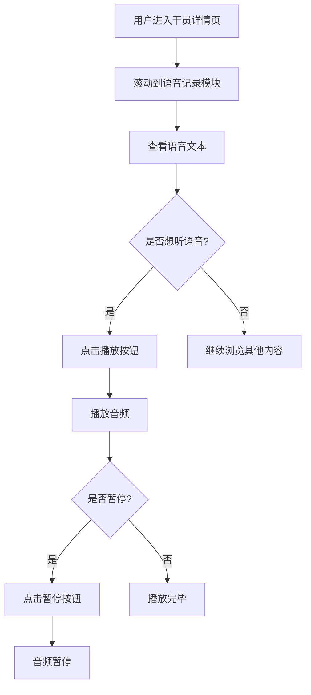

# 干员语音记录音频播放

**功能名称**: 语音记录音频播放与管理员语音修复
**PRD 版本**: v1.0
**创建日期**: 2026-07-30
**作者**: MiMoCode

## 背景与目标

### 1.1 背景

当前干员卷宗页的「语音记录」模块仅展示语音文本内容，用户只能阅读文字无法听到原始语音。产品设计文档（干员档案）中明确标注语音应为「可播放/可查看」，但音频播放功能尚未实现。

此外，管理员干员（男管理/女管理）的语音记录模块缺失，需要一并修复。

### 1.2 目标

1. 所有干员的语音记录支持音频播放，用户可点击播放按钮收听语音
2. 修复管理员干员语音记录缺失问题
3. 音频语言跟随用户当前选择的语言

### 1.3 成功标准

- 所有干员（含管理员）语音记录模块正常展示语音文本
- 每条语音记录旁显示播放按钮，点击可播放对应音频
- 音频语言与用户选择的语言一致（中文/英文/日文/韩文）
- 播放体验流畅，无明显延迟

## 用户分析

### 2.1 目标用户

- 《明日方舟：终末地》玩家
- 希望收听干员语音的用户
- 需要参考干员语音内容的用户

### 2.2 用户场景

| 场景 | 用户角色 | 目标 | 痛点 |
|------|---------|------|------|
| 收听干员语音 | 普通玩家 | 欣赏干员的语音演出 | 当前只能看文字，无法听语音 |
| 查看管理员语音 | 普通玩家 | 了解管理员的语音内容 | 管理员语音记录模块缺失 |
| 多语言语音体验 | 国际玩家 | 用母语收听语音 | 语言切换后音频应跟随变化 |

## 功能需求

### 3.1 功能概述

为干员卷宗页的「语音记录」模块增加音频播放能力，每条语音记录旁显示播放按钮，点击可播放对应音频文件。同时修复管理员干员语音记录缺失的问题。

### 3.2 功能列表

#### 功能点 1: 语音记录音频播放
- **描述**: 每条语音记录旁显示播放按钮，点击播放对应音频
- **用户价值**: 用户可以收听干员的原始语音，增强沉浸感
- **验收标准**:
  - [ ] 每条语音记录旁显示播放按钮图标
  - [ ] 点击播放按钮可播放对应音频
  - [ ] 播放中显示暂停状态，点击可暂停
  - [ ] 同一时间只能播放一条语音（新播放自动停止旧播放）

#### 功能点 2: 音频语言适配
- **描述**: 音频语言跟随用户当前选择的语言
- **用户价值**: 国际玩家可以用母语收听语音
- **验收标准**:
  - [ ] 中文（简中/繁中）使用中文音频
  - [ ] 英文使用英文音频
  - [ ] 日文使用日文音频
  - [ ] 韩文使用韩文音频
  - [ ] 其他语言默认使用英文音频

#### 功能点 3: 管理员语音记录修复
- **描述**: 修复管理员干员（男管理/女管理）语音记录模块缺失的问题
- **用户价值**: 管理员干员可以正常查看和播放语音
- **验收标准**:
  - [ ] 管理员干员详情页显示语音记录模块
  - [ ] 语音记录内容正确显示
  - [ ] 音频播放功能正常

#### 功能点 4: 移除语音数量限制
- **描述**: 移除当前语音记录最多展示 10 条的限制
- **用户价值**: 用户可以查看和播放所有语音记录
- **验收标准**:
  - [ ] 展示所有语音记录，不截断

### 3.3 用户操作流程

### 3.4 页面/界面描述

| 页面 | 描述 | 关键元素 |
|------|------|---------|
| 干员详情页 - 语音记录 | 展示语音文本与播放按钮 | 语音标题、语音文本、播放/暂停按钮 |

播放按钮设计：
- 未播放状态：显示播放图标（三角形）
- 播放中状态：显示暂停图标（双竖线）
- 按钮位于每条语音记录的右侧或标题旁

### 3.5 异常与边界情况

| 情况 | 预期行为 |
|------|---------|
| 音频文件不存在 | 播放按钮置灰或隐藏，不显示播放错误 |
| 音频加载失败 | 静默失败，不影响文本展示 |
| 用户切换语言 | 下次播放时使用新语言的音频 |
| 管理员干员语音数据缺失 | 语音记录模块不显示（与当前行为一致） |

## 四、非功能需求

### 4.1 性能要求

- 音频采用懒加载，仅在点击播放时加载
- 不预加载所有语音文件，避免带宽浪费

### 4.2 安全性要求

无特殊安全要求

### 4.3 兼容性要求

- 与现有干员详情页功能完全兼容
- 支持主流浏览器的音频播放

## 五、依赖与约束

### 5.1 依赖

- 游戏数据服务器提供音频文件（`https://endfield-assets.fffdan.com/audios/dialogs/vo/{language}/{voId}`）
- CharacterTable 中包含 `voId` 字段用于构建音频 URL

### 5.2 约束

- 仅支持中文、英文、日文、韩文四种语言的音频
- 其他语言默认回退到英文音频

## 六、相关文档

- [干员档案产品文档](docs/product/released/20260719-operator-archive.md)
- [管理员干员数据映射方案](docs/product/draft/20260725-admin-operator-data-mapping.md)
- [数据表映射参考](docs/engineering/references/data-mapping-tables.md)
