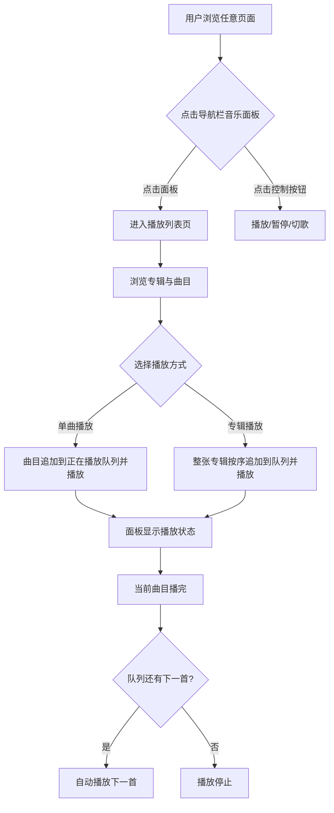

# 音乐播放与全局控制中心

**功能名称**: 音乐播放与全局控制中心
**PRD 版本**: v1.0
**创建日期**: 2026-08-04
**作者**: MiMoCode

## 背景与目标

### 1.1 背景

《明日方舟：终末地》游戏中内置了「帝江号音乐播放器」玩法，玩家可以收集音乐唱片并在飞船上播放游戏原声。当前档案馆已覆盖干员、武器、物品、剧情等档案，但缺少对游戏音乐内容的归档与欣赏能力。站点已具备语音音频播放能力（干员语音、剧情电台），具备了音频体验的产品基础，音乐是自然的延伸。

### 1.2 目标

1. 用户可以在浏览档案馆的任意页面时播放游戏原声音乐，播放不随页面切换中断
2. 用户可以浏览游戏中的完整音乐专辑与曲目列表
3. 用户通过导航栏底部的音乐控制面板随时控制播放（播放/暂停/上一首/下一首）
4. 其他界面的音乐播放入口统一汇入全局「正在播放」队列

### 1.3 成功标准

- 导航栏底部（语言切换上方）展示音乐控制面板，可完成基本播放控制
- 播放列表页完整展示游戏内全部专辑与曲目，曲目可正常播放
- 播放中切换页面，音乐不中断，控制面板状态同步
- 在任意界面点击曲目播放后，该曲目追加进「正在播放」队列

## 用户分析

### 2.1 目标用户

- 《明日方舟：终末地》玩家
- 喜欢游戏原声音乐（OST）的用户
- 边查资料边听音乐的重度档案馆用户

### 2.2 用户场景

| 场景 | 用户角色 | 目标 | 痛点 |
|------|---------|------|------|
| 浏览档案时听音乐 | 普通玩家 | 边查阅资料边欣赏游戏原声 | 需切换到其他音乐平台，且难以找到对应曲目 |
| 欣赏游戏专辑 | OST 爱好者 | 系统浏览游戏内全部专辑与曲目 | 游戏内唱片需收集解锁，无法一次听全 |
| 连续收听多首曲目 | 普通玩家 | 按专辑顺序连续播放 | 单首播放后需手动切下一首 |

## 功能需求

### 3.1 功能概述

在导航栏底部（语言切换上方）新增全局音乐控制面板，并新增「播放列表」页面展示游戏内音乐专辑。专辑列表来源于游戏数据、内容固定不可删除；用户在任意界面点击播放音乐时，曲目追加到全局「正在播放」队列连续播放。

### 3.2 功能列表

#### 功能点 1: 导航栏音乐控制面板

- **描述**: 在导航栏底部、语言切换上方新增音乐控制面板。面板显示当前曲目名称与专辑、播放/暂停、上一首/下一首按钮与播放进度；点击面板（非按钮区域）跳转到「播放列表」页面。未播放任何曲目时，面板展示为入口形态（如「音乐播放」标题 + 播放图标），点击同样跳转到播放列表页
- **用户价值**: 用户无论身处哪个页面，都能随时控制音乐播放并进入播放列表
- **验收标准**:
  - [ ] 桌面端与移动端导航栏底部均显示音乐控制面板，位于语言切换上方
  - [ ] 未播放时面板显示入口形态，点击跳转播放列表页
  - [ ] 播放中面板显示当前曲目名、专辑名与播放进度
  - [ ] 播放/暂停、上一首/下一首按钮功能正常
  - [ ] 点击面板空白区域跳转播放列表页，点击控制按钮不触发跳转

#### 功能点 2: 播放列表页面

- **描述**: 新增「播放列表」页面，展示游戏中的全部音乐专辑（来源于游戏数据）。每个专辑展示封面、专辑名与曲目列表；曲目展示名称与时长。专辑及其曲目列表为游戏官方内容，用户不可删除、不可编辑
- **用户价值**: 用户可以系统浏览游戏内全部音乐内容
- **验收标准**:
  - [ ] 页面按专辑分组展示全部专辑与曲目
  - [ ] 专辑展示封面图与名称，曲目展示名称与时长
  - [ ] 专辑与曲目无删除、编辑入口
  - [ ] 专辑与曲目名称跟随用户当前语言显示
  - [ ] 正在播放的曲目在列表中有明确标识

#### 功能点 3: 全局播放与「正在播放」队列

- **描述**: 全站共享一个「正在播放」队列。在播放列表页或其他任意界面点击某首曲目的播放按钮时，该曲目追加到「正在播放」队列末尾并开始播放；一首播放完毕后自动播放队列下一首。播放不随页面跳转中断
- **用户价值**: 用户可以连续收听多首曲目，且不影响正常的资料浏览
- **验收标准**:
  - [ ] 点击曲目播放后，曲目追加到「正在播放」队列并开始播放
  - [ ] 当前曲目播放完毕自动播放队列中的下一首
  - [ ] 切换页面时播放不中断，控制面板状态保持同步
  - [ ] 同一时间全站只有一首音乐在播放
  - [ ] 音乐播放与干员语音/剧情电台播放互斥（一方开始播放时另一方停止）

#### 功能点 4: 播放列表页播放交互

- **描述**: 在播放列表页中，点击曲目行的播放按钮即触发功能点 3 的队列追加播放行为；点击专辑级别的播放按钮，将整张专辑的曲目按顺序追加到「正在播放」队列并从第一首开始播放
- **用户价值**: 用户既可以单曲点播，也可以整张专辑连续收听
- **验收标准**:
  - [ ] 单曲播放按钮行为符合功能点 3
  - [ ] 专辑播放按钮按曲目顺序追加整张专辑并从头播放

### 3.3 用户操作流程

### 3.4 页面/界面描述

| 页面 | 描述 | 关键元素 |
|------|------|---------|
| 导航栏音乐控制面板 | 导航栏底部常驻的全局播放控制区 | 当前曲目名、专辑名、进度条、播放/暂停、上一首/下一首 |
| 播放列表页 | 游戏音乐专辑浏览与点播页面 | 专辑封面、专辑名、曲目名、时长、单曲播放按钮、专辑播放按钮、正在播放标识 |

播放列表页结构：
- 按专辑分区，每个分区顶部为专辑封面 + 专辑名 + 专辑播放按钮
- 分区下为曲目列表，每行：曲序、曲目名、时长、播放按钮
- 正在播放的曲目行高亮并显示播放中标识

### 3.5 异常与边界情况

| 情况 | 预期行为 |
|------|---------|
| 曲目音频文件不存在（如缺失的曲目） | 该曲目播放按钮置灰不可点击，其余曲目不受影响 |
| 音频加载或播放失败 | 自动跳过该曲目，尝试播放队列下一首 |
| 浏览器限制自动播放（无用户手势） | 不自动播放，等待用户点击播放按钮 |
| 队列为空时点击下一首 | 无响应，不产生错误 |
| 播放中切换语言 | 曲目/专辑名称按新语言显示，播放不中断 |
| 专辑数据为空或接口异常 | 对应专辑分区不展示，页面其余部分正常 |

## 四、非功能需求

### 4.1 性能要求

- 音频采用流式加载，仅在用户点击播放时开始加载
- 不预加载音频文件，避免带宽浪费

### 4.2 安全性要求

无特殊安全要求

### 4.3 兼容性要求

- 支持主流桌面与移动端浏览器的音频播放
- 移动端导航栏（抽屉式）中控制面板同样可用
- 与现有语音播放功能（干员语音、剧情电台）互斥共存，互不影响页面功能

## 五、依赖与约束

### 5.1 依赖

- 游戏数据服务器提供专辑与曲目数据（专辑、曲目、专辑-曲目关联数据表）
- 游戏数据服务器提供音乐音频文件流
- 曲目与专辑名称的多语言文本来源于游戏数据

### 5.2 约束

- 专辑与曲目列表为游戏官方内容，不提供用户自建/编辑/删除列表能力
- 「正在播放」队列仅存在于当前会话，不做持久化（刷新页面后队列清空）
- 音频语言不随界面语言变化（音乐为纯音频，无语言版本之分）

## 六、相关文档

- [语音记录音频播放产品文档](docs/product/draft/20260730-voice-audio-playback.md)
- [站点概念设计](docs/product/released/20260719-site-concept.md)
