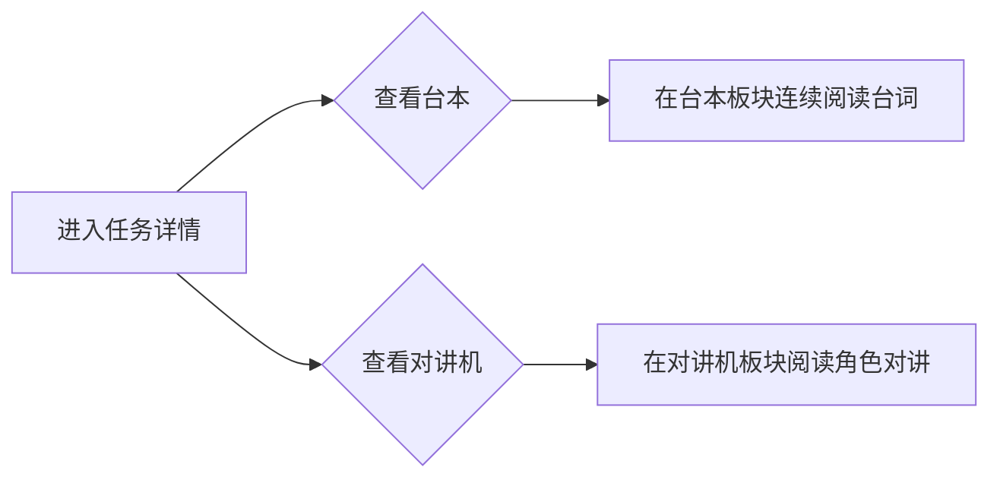

# 剧情梗概：台本与对讲机

**功能名称**: 剧情梗概详情新增「台本（Transcript）」与「对讲机（Radio）」
**PRD 版本**: v1.0
**创建日期**: 2026-08-09
**作者**: 产品

## 背景与目标

### 1.1 背景

当前剧情梗概模块（`/archive/story/recap`）已支持按篇章、任务组织剧情梗概，并在单个任务的详情中对每一场戏提供可展开的对话剧本（`DialogTextTable`，逐场展开）。但现有呈现有以下不足：

- **对话剧本按场零散展开**：每场戏需手动点击展开，缺少一场任务完整、连续的「台本」通读体验。
- **对讲机剧情完全缺失**：游戏内在任务对话中穿插了大量角色之间的「对讲机（Radio）」剧情，这些台词（`RadioTable`）与对话正文一样承载了重要剧情信息，目前完全未在站点呈现。

游戏数据中，`DialogTextTable`（台本，20872 条台词）与 `RadioTable`（对讲机，2948 条台词）均以剧情的 key 为前缀组织（见 §3.2），可从单个任务的 key 稳定回溯到该任务所属的全部原文，具备按任务聚合展示的数据基础。

### 1.2 目标

在剧情梗概的**单个任务详情**中，新增两个原文板块：

- **台本（Transcript）**：聚合该任务全部 `DialogTextTable` 台词，按场连续展示，供通读与引用。
- **对讲机（Radio）**：聚合该任务全部 `RadioTable` 台词，按场景展示台词。

两个板块均随全局语言切换显示对应语言的原文。

### 1.3 成功标准

- 任务详情页完整呈现该任务全部对话（台本）与对讲机台词，无遗漏、无重复。
- 台本按「场 → 行」自然顺序连续通读，编号可定位到具体台词。
- 对讲机台词按场景展示，说话人与台词正确对应。
- 全部文本跟随全局 14 语言切换正确显示。
- 无台本/无对讲机的任务展示空态提示，不报错。

## 用户分析

### 2.1 目标用户

- **剧情党玩家**：想一段剧情中完整阅读角色对话，而非逐场展开的支离片段。
- **设定研究者**：需要引用对讲机剧情原文或对某段对话进行原文考据。
- **内容编辑者**：需要结构化的、可排序引用的完整原文来源。

### 2.2 用户场景

| 场景 | 用户角色 | 目标 | 痛点 |
|--|--|--|--|
| 完整通读某任务 | 剧情党玩家 | 连续阅读一场任务的完整对话 | 现需逐场点击展开，无法一气呵成 |
| 引用台本台词 | 内容编辑者 | 获取对话原文及可定位编号 | 无连续原文，编号不稳 |
| 查看对讲机剧情 | 设定研究者 | 阅读任务中的对讲机台词 | 对讲机剧情完全未展示 |

## 功能需求

### 3.1 功能概述

在剧情梗概单个任务详情（含 `/archive/story/recap` 右侧内嵌详情与独立任务详情页）中，新增两个板块：

- **台本（Transcript）**：来源 `DialogTextTable`。按任务的 key（任务下所有场次的对话场景前缀）聚合台词，按场次与台词顺序完整展示。
- **对讲机（Radio）**：来源 `RadioTable`。按任务的 key 聚合对讲机台词，按场景顺序展示。

两个板块均位于任务描述与目标任务之间（或任务描述之后）。

### 3.2 数据关联说明

游戏数据中目标 key 的编码规律（数据规律归纳，实现阶段需抽样校准）：

| 数据表 | key 示例 | key 结构 | 与任务的关系 |
|--------|---------|---------|-------------|
| `DialogTextTable`（台本） | `dlg_gm02m13_3_001` | `dlg_{章前缀}{任务}_{场次}_{行号}` | 一场戏的多行台词共用同一场次前缀 `dlg_gm02m13_3`；同一任务聚合其全部场次前缀 |
| `RadioTable`（对讲机） | `radio_gm02m13_3` | `radio_{任务key}_{场次序号}` | 一场戏一条对讲记录；key 含 `l`/`d` 任务段变体时前缀随之变化 |

- **台本聚合**：给定任务 key，取全部 `dlg_{任务key}_{场次}_...` 前缀匹配的行，按场次与行号排序。
- **对讲机聚合**：给定任务 key，取全部 `radio_{任务key}_...` 记录，按场次排序。
- 具体匹配规则（前缀归一化、`l`/`d` 变体）由工程方案定义。

### 3.3 功能列表

#### 功能点 1: 台本（Transcript）板块

- **描述**: 任务详情中展示该任务全部 `DialogTextTable` 台词。按场（scene/dlg 前缀）分组，场内按台词顺序排布；每条台词展示说话人（角色名）与台词原文，富文本正确渲染。
- **用户价值**: 一场/一段任务可完整连续阅读所有台词，便于通读与引用。
- **验收标准**:
  - [ ] 台本聚合任务全部台词，无遗漏、无重复。
  - [ ] 台词按在场顺序排序，分组清晰。
  - [ ] 每条展示说话人 + 台词原文。
  - [ ] 无台词任务展示空态提示。

#### 功能点 2: 对讲机（Radio）板块

- **描述**: 任务详情中展示该任务全部对讲机台词。按场景展示说话人与台词。
- **用户价值**: 补齐对讲机剧情，还原任务过程中的角色对讲机交流。
- **验收标准**:
  - [ ] 对讲机台词按任务聚合、按场景顺序展示。
  - [ ] 每条展示说话人 + 台词原文。
  - [ ] 无对讲机台词任务展示空态提示。

### 3.4 用户操作流程

### 3.5 页面/界面描述

| 页面 | 描述 | 关键元素 |
|------|------|---------|
| 任务详情 | 现有任务描述、任务目标之后（或描述之后）新增两板块 | 「台本（Transcript）」节：按场分组的台词流；「对讲机（Radio）」节：逐条说话人 + 台词 |

视觉沿用现有任务详情对话样式：说话人姓氏色金／绯红，台词正文象牙白，说话人用较窄栏位展示。

### 3.6 异常与边界情况

| 情况 | 预期行为 |
|------|---------|
| 该任务无台本台词 | 台本板块显示「暂无台本」（story.noTranscript）|
| 该任务无对讲机台词 | 对讲机板块显示「暂无对讲机」（story.noRadio）|
| 台词缺说话人 | 进阶展示角色 id 或「未知」占位 |
| 某场台词缺失部分行 | 展示已有行，不报错 |
| 台词原文缺译文 | 回退展示台词 key / 原文等，沿用全局回退策略 |

## 四、非功能需求

### 4.1 性能要求

- 台本与对讲机数据按需加载（进入任务详情时），不随列表页加载。
- `DialogTextTable`（2 万+ 行）与 `RadioTable`（近 3 千条）全表按缓存策略一次到位、任务内过滤。

### 4.2 兼容性要求

- 全部文案跟随全局 14 语言切换。
- 桌面端与移动端均可用。

### 4.3 内容提示

- 台本与对讲机涉及剧情剧透，维持任务详情既有剧透提示。

## 五、依赖与约束

### 5.1 依赖

- 游戏数据服务提供的 `DialogTextTable` 与 `RadioTable` 及对应 i18n dict。
- 现有任务详情（`MissionDetailContent`）的既有数据流。

### 5.2 约束

- 仅做呈现层聚合，不改变原有逐场对话展开能力。
- 不引入台词级音频播放（沿用现有对话播放能力即可，属可选增强，不在本次范围）。
- 台本/对讲机 key 匹配规则基于数据规律归纳，实现阶段需抽样校准。

## 六、相关文档

- [[20260730-story-chronicle|剧情纪事]]
- [[../../engineering/references/data-mapping-tables|数据表映射参考]]