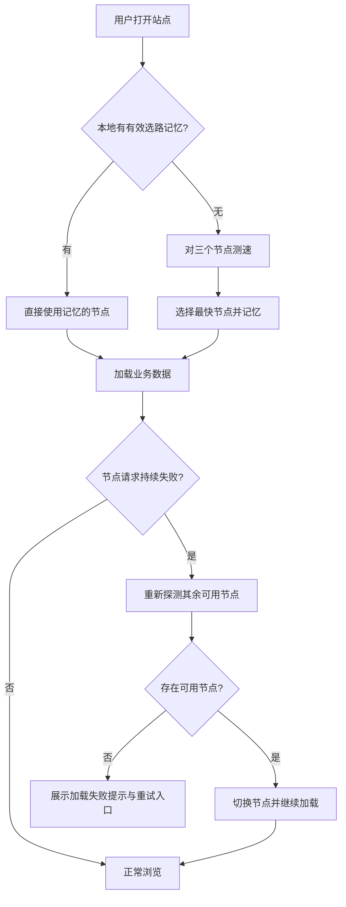

# 数据 CDN 自动优选

**功能名称**: 数据 CDN 自动优选
**PRD 版本**: v1.0
**创建日期**: 2026-09-08
**作者**: 产品

## 背景与目标

### 1.1 背景

《宏山档案馆》的全部游戏数据（数据表、多语言文本、图片素材）均来自远端数据服务。目前站点固定使用单一数据节点 `https://endfield-assets.fffdan.com`，不同地区、不同网络运营商的用户访问速度差异很大：部分用户加载迅速，部分用户则要经历长时间等待，甚至在加载提示中触发慢加载警告。

当前已具备三个可用线上数据节点：

- `https://endfield-assets.fffdan.com/`
- `https://cn.endfield.fffdan.com/`
- `https://cn2.endfield.fffdan.com/`

三个节点提供完全一致的数据内容，可作为同一数据服务的多个入口。

### 1.2 目标

- 用户打开站点时，自动从三个数据节点中选择当前网络环境下速度最快的一个，后续所有数据请求与图片素材均走该节点。
- 整个优选过程对用户透明，不需要用户手动配置。
- 当所选节点出现异常时，能够自动切换到其他可用节点，保证站点可用性。

### 1.3 成功标准

- 任意网络环境下，站点首次数据加载使用的均为实测最快的节点。
- 三个节点中任意一个不可用，不影响其他用户正常浏览（自动避开故障节点）。
- 三个节点全部不可用时，给出明确的加载失败提示与重试入口，不出现无限等待。

## 用户分析

### 2.1 目标用户

所有访问《宏山档案馆》的终端用户，尤其是与默认数据节点之间链路质量较差的用户（如特定地区、特定运营商网络）。

### 2.2 用户场景

| 场景 | 用户角色 | 目标 | 痛点 |
|--|--|--|--|
| 首次打开站点 | 普通访客 | 快速浏览干员/武器/敌人档案 | 默认节点链路差时首屏加载缓慢 |
| 日常使用 | 回访用户 | 稳定、快速地查询数据 | 网络环境变化后速度波动，无感知优化手段 |
| 节点故障期间 | 普通访客 | 继续正常使用站点 | 单一节点故障导致整站不可用 |

## 功能需求

### 3.1 功能概述

站点启动时对三个候选数据节点进行速度探测，自动选择响应最快的节点作为本次访问的数据来源；选择结果在本地记住一段时间，避免每次打开都重新探测；当所选节点持续失败时自动重新探测并切换。

### 3.2 功能列表

#### 功能点 1: 启动自动测速选路

- **描述**: 用户打开站点后，在正式开始加载业务数据之前，自动对三个候选节点进行速度探测，选出最快的节点，之后所有数据与图片请求都使用该节点。
- **用户价值**: 无论用户身处何地、使用何种网络，都能获得当前条件下最快的数据加载速度。
- **验收标准**:
  - [ ] 首次打开站点时，业务数据请求均发往实测最快的节点。
  - [ ] 测速过程不阻塞页面渲染，不产生额外的错误提示。
  - [ ] 测速本身在合理时间内完成（秒级），不显著拖慢首次数据加载。

#### 功能点 2: 选路结果本地记忆

- **描述**: 测速结果在用户本地保留一段时间（有效期内直接使用上次结果），过期后自动重新探测。
- **用户价值**: 回访用户无需每次等待测速，打开即可用，同时网络环境变化后又能自动纠正。
- **验收标准**:
  - [ ] 有效期内的回访直接使用记忆的节点，不再触发探测。
  - [ ] 有效期过期后，下一次访问重新探测并更新记忆。
  - [ ] 记忆的节点不可用时按"功能点 3"处理，不会因为记忆而卡死。

#### 功能点 3: 故障自动切换与兜底

- **描述**: 当当前使用的节点请求持续失败时，自动重新探测其余节点并切换；若所有节点均不可用，保持现有的加载失败提示与重试能力。
- **用户价值**: 单个节点故障不再意味着站点不可用，用户几乎无感知地完成切换。
- **验收标准**:
  - [ ] 当前节点不可用时，请求自动切换到其他可用节点并完成加载。
  - [ ] 三个节点全部不可用时，页面呈现明确的加载失败提示，用户可手动重试。
  - [ ] 切换节点后，已缓存数据按现有版本机制正常校验，不出现脏数据。

### 3.3 用户操作流程

### 3.4 页面/界面描述

本功能为无感知的基础设施能力，不新增独立页面。

| 页面 | 描述 | 关键元素 |
|------|------|---------|
| 全站 | 选路过程对用户透明，仅体现为加载速度提升 | 无新增 UI |
| 全站加载失败态 | 所有节点不可用时沿用现有加载提示的加载失败与重试能力 | 现有加载提示浮层 |

### 3.5 异常与边界情况

| 情况 | 预期行为 |
|------|---------|
| 三个节点全部不可用 | 展示加载失败提示，提供重试入口，不无限等待 |
| 测速期间个别节点无响应 | 该节点视为不可用，从剩余节点中选择最快的 |
| 记忆的节点过期后故障 | 重新探测时自动避开故障节点 |
| 用户网络在会话中途变化 | 当前会话不强制重新测速；节点失败时按故障切换处理 |
| 用户处于离线环境 | 视为全部节点不可用，走加载失败提示 |

## 四、非功能需求

### 4.1 性能要求

- 启动测速应在秒级内完成，且不得阻塞首屏渲染。
- 有有效记忆时，选路零耗时。

### 4.2 安全性要求

- 仅允许在预定义的三个节点列表中选择，不接受外部输入的节点地址。

### 4.3 兼容性要求

- 不改变现有任何页面功能与数据展示内容。
- 三个节点数据内容一致，切换节点不改变用户看到的数据。

## 五、依赖与约束

### 5.1 依赖

- 三个数据节点长期可用且数据内容保持一致。
- 现有缓存与版本校验机制（数据版本变化时自动失效）。

### 5.2 约束

- 节点列表变更（新增/下线）需要随站点版本发布更新，不提供用户侧配置入口。

## 六、相关文档

- [站点概念设计](../released/20260719-site-concept.md)
- [数据 CDN 自动优选技术提案](../../engineering/proposal/20260908-cdn-auto-selection.md)
