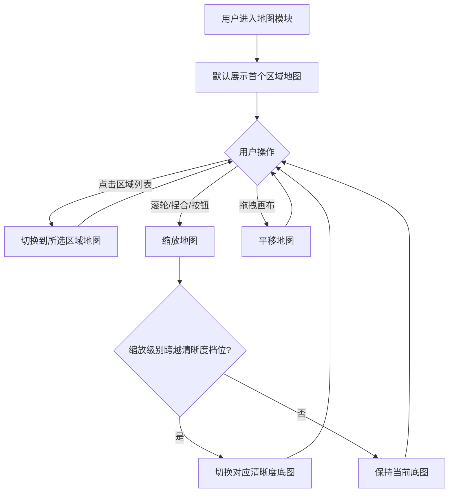

# 地图浏览器

**功能名称**: 地图浏览器
**PRD 版本**: v1.0
**创建日期**: 2026-09-17
**作者**: 产品

## 背景与目标

### 1.1 背景

《宏山档案馆》目前覆盖了干员、武器、敌人、道具、地理等资料维度，但缺少对游戏世界地理空间的直观呈现。玩家在查阅某个区域（如四号谷地、武陵）的资料时，无法看到该区域的实际地图样貌、地名分布与区域之间的连接关系。

游戏本身提供了完整的多关卡地图：每张地图由高清瓦片底图构成，包含地名标签、关卡切换入口、定居点等标注信息，共覆盖 4 个区域分组下的 21 张关卡地图。这些内容具备整合成站内"地图浏览器"的条件。

### 1.2 目标

- 用户可以在站内查看游戏内各区域的完整地图，地图画面占满除侧边栏外的剩余区域，获得沉浸式的浏览体验。
- 用户可以在多个区域（关卡地图）之间自由切换查看。
- 用户可以缩放、平移地图，查看整体布局与局部细节。
- 地图上呈现与游戏一致的地名、入口、定居点等标注，帮助用户建立空间认知。

### 1.3 成功标准

- 全部 21 张可用关卡地图均可在站内正常浏览，切换区域无页面跳转等待。
- 地图从全景缩放到最大细节级别时画面清晰可读，缩放过程流畅。
- 地图上的地名与标注信息与游戏内一致，且随站点语言切换显示对应语言。

## 用户分析

### 2.1 目标用户

- 《明日方舟：终末地》玩家：查询区域地理、确认地名与地点位置。
- 资料站访客：在查阅地理、敌人、物产等档案时，希望获得空间参照。

### 2.2 用户场景

| 场景 | 用户角色 | 目标 | 痛点 |
|--|--|--|--|
| 浏览区域地理 | 玩家 | 查看某区域整体地图与地名分布 | 站内无地图，只能凭文字想象地理关系 |
| 对照游戏查资料 | 玩家 | 确认某个地点/入口在地图上的位置 | 游戏内外信息割裂，需要自行对照 |
| 研究区域结构 | 深度玩家 | 理解多区域间的连接关系与分层结构 | 缺少跨区域的统一视图 |

## 功能需求

### 3.1 功能概述

新增"地图"档案馆模块：左侧区域选择，右侧画布占满剩余空间渲染所选区域的地图底图与标注点，支持缩放、平移与区域切换。

### 3.2 功能列表

#### 功能点 1: 区域地图浏览

- **描述**: 地图画面作为页面主体，占满除站点侧边栏外的全部剩余区域。进入模块后默认展示第一个区域的地图；用户通过区域列表在多个区域之间切换，区域按地理分组（如四号谷地、武陵、塔卫二等）组织。
- **用户价值**: 沉浸式、大画幅的地图浏览体验，区域组织方式与游戏内一致，易于定位。
- **验收标准**:
  - [ ] 地图画布占满除侧边栏外的剩余可视区域，窗口尺寸变化时自适应。
  - [ ] 区域列表按地理分组展示全部可查看区域，区域名称随站点语言显示。
  - [ ] 点击区域条目即可切换地图，无需整页刷新；当前选中区域在列表中有明确高亮。
  - [ ] 某区域地图素材缺失或加载失败时，展示占位提示而非空白或报错页面。

#### 功能点 2: 地图缩放与平移

- **描述**: 支持对地图进行多级缩放（滚轮 / 触控板捏合 / 缩放按钮）与拖拽平移。缩放到不同级别时自动切换对应清晰度的地图细节：缩小时看到全景，放大到最大级别时文字与地形细节清晰。
- **用户价值**: 既能俯瞰区域全貌，也能放大查看局部地名与地标细节。
- **验收标准**:
  - [ ] 支持从全景到最大细节级别的连续缩放，最大级别下画面清晰。
  - [ ] 缩放时以指针位置为锚点，平移不超出地图边界。
  - [ ] 切换缩放级别时底图清晰度随之切换，不出现长时间模糊等待。
  - [ ] 缩放与平移操作流畅，无明显卡顿。

#### 功能点 3: 地图标注点

- **描述**: 在地图上按游戏内真实位置叠加标注：地名标签、关卡切换入口（带方向）、定居点、跨层切换点等。标注以图标或文字标签呈现，位置与缩放级别联动，随地图同步缩放平移。
- **用户价值**: 标注信息与游戏内地图一致，用户可以直接对照游戏确认地点位置。
- **验收标准**:
  - [ ] 地名标签、关卡入口、定居点等标注的位置与游戏内一致。
  - [ ] 标注文字随站点语言切换显示对应语言。
  - [ ] 标注随地图缩放平移保持正确的相对位置，不发生漂移。
  - [ ] 标注在小缩放级别下不互相遮挡堆叠到不可读的程度（可通过随缩放显隐控制密度）。

### 3.3 用户操作流程

### 3.4 页面/界面描述

| 页面 | 描述 | 关键元素 |
|------|------|---------|
| 地图浏览页 | 全画幅地图浏览，占满侧边栏外剩余区域 | 区域选择列表（按分组）、地图画布、缩放控件、标注层 |

### 3.5 异常与边界情况

| 情况 | 预期行为 |
|------|---------|
| 某区域地图素材缺失 | 该区域显示占位提示，不影响其他区域浏览 |
| 标注文本暂无对应语言翻译 | 回退到默认语言显示，不缺失标注 |
| 极慢网络下底图加载 | 显示加载状态，瓦片按可见区域逐步加载，不阻塞缩放平移操作 |
| 地图平移至边界 | 平移被限制在地图范围内，不出现大片空白 |
| 窗口尺寸变化 | 画布自适应，缩放与平移状态尽量保持 |

## 四、非功能需求

### 4.1 性能要求

- 区域切换后地图首屏底图在常规网络下秒级呈现。
- 缩放平移交互帧率流畅，底图清晰度切换不出现长时间空白。

### 4.2 安全性要求

无特殊安全要求。

### 4.3 兼容性要求

- 支持桌面端浏览器；缩放支持滚轮与触控板手势。
- 沿用站点既有语言体系，全部界面文案与标注支持多语言。

## 五、依赖与约束

### 5.1 依赖

- 远端数据服务提供地图瓦片素材与地图配置数据，并随游戏版本更新。
- 站点现有缓存与版本失效机制（游戏版本变化时自动刷新缓存）。

### 5.2 约束

- 本期仅做只读浏览，不提供用户标注、路径规划等编辑能力。
- 迷雾解锁状态、分层切换等游戏进度相关内容不在本期范围内。

## 六、相关文档

- [站点概念设计](../released/20260719-site-concept.md)
- [地图浏览器技术提案](../../engineering/proposal/20260917-map-viewer.md)
