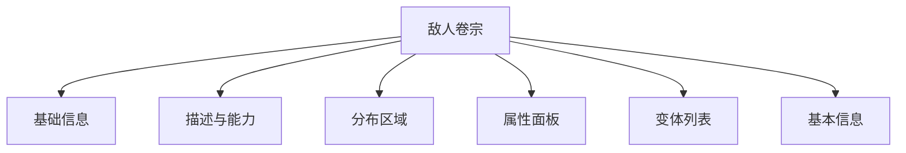

# 敌人图鉴

敌人图鉴收录塔卫二上出现的各类敌对生物与武装分子，支持按阵营与星级浏览，并提供详细的战斗属性。

## 敌人列表

列表页以卡片网格展示敌人，每张卡片呈现：

- 敌人图标
- 名称
- 类型（普通/精英/Boss 等）
- 星级
- 所属阵营/分组
- 标签

### 搜索与筛选

| 能力 | 说明 |
|------|------|
| 搜索 | 按名称或 ID 模糊搜索 |
| 星级 | 按 1–6 星过滤 |
| 阵营 | 按所属分组过滤（天使、裂地者、宏山、动物等） |

### 排序、分组与分页

- 排序：星级、名称，支持升序/降序。
- 分组：按阵营分组展示。
- 分页：每页 12 / 24 / 48 / 全部。

## 敌人卷宗

卷宗页展示单个敌人的完整战斗与背景信息：

### 基础信息

- 名称、昵称
- 类型标签
- 星级
- 所属阵营
- 敌人标签

### 描述与能力

- 敌人描述文本
- 技能/能力描述列表

### 分布区域

以颜色标签展示该敌人可能出现的区域或关卡：

- 绿色：新增分布
- 红色删除线：移除分布
- 灰色：已有分布

### 属性面板

- 提供等级滑动条，查看不同等级下的属性数值。
- 展示等级依赖属性、固定属性、属性修正。
- 展示伤害抗性（物理、火、电磁等）与韧性相关数值。

### 变体列表

同一模板下可能存在多个变体，每个变体拥有独立的等级滑动条与属性面板，便于对比不同变体之间的数值差异。

### 基本信息

- 模板 ID
- 敌人 ID
- 最大等级

## 关联入口

敌人卷宗中的分布区域与相关属性可关联至地区地理与道具材料模块（待进一步建设）。

## 相关文档

- [[20260719-site-concept|站点概念设计]]
- [[20260719-items-materials|道具材料]]
