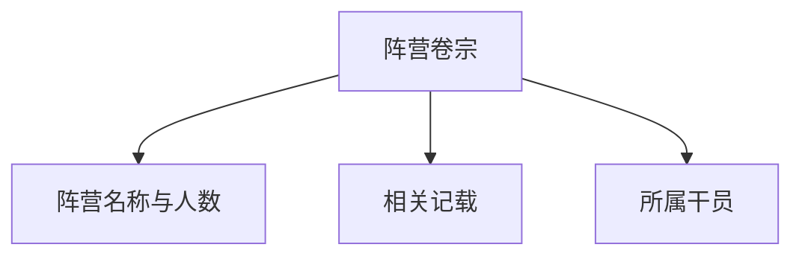

# 干员阵营

干员阵营模块整理塔卫二上的政治实体与组织，以及干员与这些势力之间的归属关系。

## 阵营列表

列表页以卡片网格展示所有势力阵营，每张卡片显示：

- 阵营中文名称
- 阵营英文名称（如有）
- 该阵营下的干员数量
- 若干该阵营干员的小头像预览

点击卡片进入阵营卷宗。

## 阵营卷宗

卷宗页展示单个阵营的详细信息：

### 相关记载

通过全文检索能力，搜索阵营名称在游戏文本中的出现位置，展示来源与原文片段，并将阵营名称高亮。

### 所属干员

以干员卡片网格展示该阵营下的全部干员，点击可进入干员卷宗。

## 已知势力示例

- 终末地工业
- 罗德岛
- 宏山 / 宏山科学院
- 清波寨
- 塞什卡
- 环塔商会
- 联盟工团

## 关联入口

- 干员卷宗中的阵营字段可跳转至对应阵营卷宗。
- 阵营卷宗中的干员卡片可跳转至干员卷宗。

## 相关文档

- [[20260719-site-concept|站点概念设计]]
- [[20260719-operator-archive|干员档案]]
- [[20260719-races|干员种族]]
