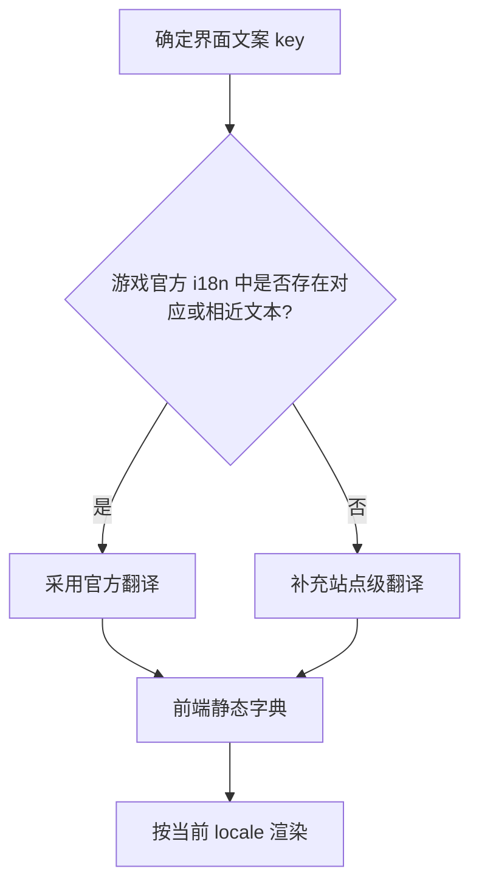
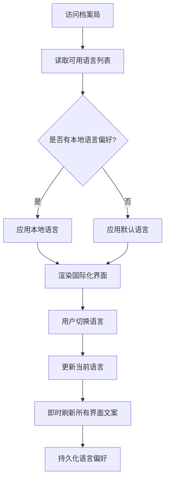

# 宏山档案局界面国际化完善方案

**功能名称**: 档案局国际化完善
**PRD 版本**: v1.0
**创建日期**: 2026-07-19
**上线日期**: 2026-07-19
**状态**: 已上线
**作者**: 产品设计

> 本方案已实现并合入 main。实现细节与 key 列表参见 [[20260719-globalization-i18n-plan|技术实现方案]] 与 [国际化规范](../../engineering/references/i18n-spec.md)。

## 背景与目标

### 1.1 背景

当前宏山档案局已支持通过侧边栏切换界面语言，游戏内数据（干员、武器、敌人、道具等）的多语言内容由远端数据服务按当前语言动态返回。然而，站点自创的界面文案——包括侧边导航分组标题、页面标题、筛选器默认文字、按钮文字、空态与错误提示等——仍以中文硬编码形式散落在各组件中。当用户切换至英语、日语、韩语等非中文语言时，这些文案不会随之变化，造成明显的语言断层，削弱了档案局作为多语言资料站的官方感与一致性。

### 1.2 目标

- 重新梳理站点整体界面文案，建立一套与语言切换联动的国际化（Globalization）设计。
- 设计一套前端 I18n 方案，将硬编码文案抽离为可翻译的 key，并统一存储在前端。
- 翻译文字优先从游戏官方 i18n 数据中检索，确保术语与游戏本体保持一致；无法直接匹配的自定义文案，补充站点级翻译。
- 可用语言列表由 API 动态获得，与现有语言切换组件保持一致。
- 切换语言后，所有界面文案（含导航、筛选器、按钮、提示、占位页）即时刷新，无需重新加载页面。

### 1.3 成功标准

- 全站无中文硬编码的界面文案残留（游戏数据中的中文内容除外）。
- 切换语言后，导航、筛选器、按钮、空态、错误提示等文案即时生效。
- 各语言术语与游戏官方翻译保持一致，如「干员」「武器」「敌人」「道具」等。
- 新增界面文案必须遵循 I18n key 规范，不再直接写入具体文字。
- 语言切换入口继续放置在侧边栏底部，可用语言由 API 决定。

## 用户分析

### 2.1 目标用户

- **核心用户**：不同语言区的终末地管理员，需要以母语查阅资料。
- **次要用户**：攻略作者、数据研究者，需要截图或引用多语言版本信息。
- **潜在用户**：尚未熟悉游戏设定的玩家，通过母语界面建立对塔卫二世界观的认知。

### 2.2 用户场景

| 场景 | 用户角色 | 目标 | 痛点 |
|------|----------|------|------|
| 非中文玩家浏览档案局 | 海外管理员 | 以母语流畅使用站点 | 导航与筛选器仍显示中文，难以定位功能 |
| 切换语言后查看干员列表 | 核心玩家 | 所有界面元素语言一致 | 只有数据切换，控件文字未切换，体验割裂 |
| 截图分享攻略到国际社区 | 内容创作者 | 界面与数据均为目标语言 | 硬编码中文会破坏截图的专业感 |
| 移动端使用小屏筛选 | 全量用户 | 快速理解筛选器选项 | 中文占位文字在小屏下造成误读 |

## 功能需求

### 3.1 功能概述

本次完善不改变现有信息架构、数据接口与页面结构，仅将散落在组件中的静态文案抽离为可国际化的 key，并为每个 key 提供多语言翻译。翻译来源以游戏官方 i18n 数据为主，站点自定义概念为辅。

### 3.2 文案范围

需要纳入国际化的文案分为以下五类：

#### 3.2.1 站点品牌与全局导航

- 站点名称：宏山档案局
- 侧边栏顶部标识与首页标题
- 导航分组：人事档案、威胁档案、物资档案、地理档案、大事记
- 导航项：干员档案、干员种族、干员阵营、敌人图鉴、道具材料、武器档案、装备系统、工厂系统、地区地理、剧情记录、更新日志

#### 3.2.2 通用界面控件

- 搜索占位符
- 筛选器默认项：全部、全部类型、全部星级、全部稀有度、全部职业、全部元素等
- 排序与分组标签
- 正序 / 倒序切换按钮
- 分页按钮：上一页 / 下一页
- 返回链接

#### 3.2.3 页面标题与描述

- 各列表页标题：干员档案、武器档案、种族一览、势力阵营、敌人图鉴、道具材料、剧情记录、更新日志、装备系统、工厂系统、地区地理
- 首页欢迎语与卷宗描述
- 占位模块提示

#### 3.2.4 详情页标签

- 基本信息、物品描述、道具说明、武器说明
- 相关记载、所属干员
- 包含内容、固定奖励、随机奖励
- 新增、移除、变更（更新日志统计）

#### 3.2.5 状态与异常提示

- 加载失败、加载中
- 暂无记录、未找到匹配结果
- 缺少参数、未找到武器 / 敌人等

### 3.3 翻译来源原则

优先采用官方翻译的示例：

| 中文文案 | 官方 i18n key / ID | 说明 |
|----------|-------------------|------|
| 干员 | `ui_friend_card_operator` / 4587871773125153579 | 游戏内「干员」标准翻译 |
| 武器 | `ui_wiki_common_wpn` / -5172571920525154197 | 游戏内 Wiki「武器图鉴」 |
| 道具/物品 | `ui_wiki_common_mat` / -6832531754290229270 | 游戏内 Wiki「物品图鉴」 |
| 装备 | `ui_wiki_common_equip` / -2258509209715706807 | 游戏内 Wiki「装备图鉴」 |
| 威胁/敌人 | `ui_wiki_common_eny` / 8742258141975205570 | 游戏内 Wiki「威胁图鉴」 |
| 种族 | `ui_fac_settlement_char_race` / -4169092580478466908 | 游戏内「种族」 |
| 技能 | `LUA_CHAR_INFO_BASIC_SKILL_TITLE` / -1627707113686409986 | 游戏内「技能」 |
| 排序 | `LUA_COMMON_SORT_TITLE` / -5741249201421562043 | 游戏内通用「排序」 |
| 筛选 | `LUA_COMMON_FILTER_TITLE` / -1121143716786680081 | 游戏内通用「筛选」 |
| 取消 | `LUA_CANCEL` / -7995171946680413439 | 游戏内通用「取消」 |
| 返回 | `LUA_CHAR_FORMATION_BACK` / 4109135557850577026 | 游戏内通用「返回」 |
| 加载中 | `ui_achv_list_search_loading` / -8683146888103394046 | 游戏内加载提示 |
| 加载失败 | `CS_FATAL_ERROR_LOAD_IMPORTANT_DATA_FAILED` / -708947455973234252 | 游戏内数据加载失败提示 |

### 3.4 语言切换体验

- 可用语言列表仍由 API `/i18n` 动态获得，当前支持简中、繁中、英语、日语、韩语、俄语等。
- 切换语言后，界面文案与游戏数据同步刷新。
- 语言选择持久化到本地，下次访问自动恢复。
- 当前选中语言在切换菜单中高亮显示。

### 3.5 用户操作流程

### 3.6 异常与边界情况

| 情况 | 预期行为 |
|------|----------|
| 某语言缺少特定 key 翻译 | 回退至默认语言（简中），不出现空字符串 |
| API 获取语言列表失败 | 使用预设默认语言列表（CN / EN），保证站点可用 |
| 新增页面忘记补充翻译 | 开发阶段通过 key 扫描工具拦截 |
| 繁中/简中差异 | 分别维护，不强制一致 |

## 设计语言

### 4.1 文案语气

- 保持档案局的官方、克制、秩序感。
- 避免口语化，优先使用游戏本体已确立的术语。
- 同一概念在站点各处使用同一 key，避免多种说法混用。

### 4.2 多语言排版

- 中文、日文、韩文保持现有行高与字号。
- 英文、俄文等长单词适当允许折行，避免截断。
- 导航与按钮文字长度差异较大时，优先保证可读性，必要时缩小字号或省略展示。

## 非功能需求

### 5.1 性能要求

- 静态翻译字典体积控制在合理范围，不得显著增加首屏加载时间。
- 语言切换不应触发全站重新请求游戏数据，仅重新渲染依赖文案的界面部分。

### 5.2 可维护性要求

- 所有翻译 key 集中管理，按模块或页面分组。
- 新增文案遵循命名规范，避免随意命名。
- 提供翻译缺失扫描脚本，便于持续维护。

### 5.3 可扩展性要求

- 支持随时新增语言，只需补充对应翻译文件。
- 支持随时新增 UI key，不影响现有翻译。

## 依赖与约束

### 6.1 依赖

- 现有语言切换组件与 `LocaleProvider` 不变。
- 现有 API `/i18n` 继续提供可用语言列表。
- 现有数据获取链路不变。

### 6.2 约束

- 不引入重量级的第三方 i18n 库，保持构建产物体积可控。
- 不修改游戏数据字段的解析逻辑。
- 产品文档不描述具体前端组件、接口封装或项目结构。

## 验收标准

- [ ] 侧边导航所有文案可通过语言切换即时变更。
- [ ] 各列表页筛选器、排序、分组、分页文案可通过语言切换即时变更。
- [ ] 详情页标签与按钮文案可通过语言切换即时变更。
- [ ] 首页卷宗标题与描述可通过语言切换即时变更。
- [ ] 空态、错误、加载提示文案可通过语言切换即时变更。
- [ ] 新增界面文案全部通过 I18n key 引用，无新增硬编码文字。
- [ ] 翻译缺失时回退至默认语言，页面不报错、不空白。

## 相关文档

- [[20260719-site-concept|宏山档案局概念设计]]
- [[20260719-archive-bureau-redesign|宏山档案局整体品牌升级与视觉重构方案]]
- [[20260719-sidebar-navigation-grouping|侧边栏导航分组]]
