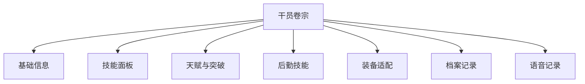

# 干员档案

干员档案收录《明日方舟：终末地》中所有可操作角色，支持列表浏览与单干员卷宗查阅。

## 翻阅范围

- 干员列表页
- 干员卷宗页
- 职业与属性快捷入口
- 种族/阵营关联入口

## 干员列表

列表页以卡片网格展示全部干员，每张卡片呈现：

- 头像缩略图
- 名称
- 稀有度星级
- 种族与阵营
- 元素形态、职业、主属性图标
- 战斗标签（最多展示 3 个）

### 筛选

列表顶部提供 8 组筛选器，可组合使用：

| 筛选维度 | 说明 |
|----------|------|
| 元素 | 寒冷、灼热、电磁、自然、物理等 |
| 职业 | 近卫、重装、辅助、术师、先锋、突击等 |
| 稀有度 | 1–6 星 |
| 标签 | 战斗特性标签 |
| 种族 | 鲁珀、菲林、萨科塔等 |
| 阵营 | 终末地工业、罗德岛、宏山等 |
| 主属性 | 攻击力、防御力、生命值等 |
| 副属性 | 同上 |

### 排序与分组

- 排序：职业、稀有度、元素、种族、阵营，支持升序/降序。
- 分组：可选择按元素、职业、稀有度、种族、阵营或主属性将列表拆分为多个小节展示。

## 干员卷宗

卷宗页展示单个干员的完整信息，按模块组织：

### 基础信息

- 名称、稀有度、职业、元素形态
- 主属性与副属性
- 种族、阵营、战斗标签
- 头像/立绘

### 技能面板

- 技能按普通攻击、主动技能、连携技能、必杀技能排序。
- 提供等级滑动条（1–12 级），实时刷新技能数值与描述。
- 双形态技能分左右两栏展示，包含消耗、冷却、描述与子描述。
- 描述中的富文本（颜色、标记、超链接、图片）正常解析。

### 天赋与突破

- 天赋节点按类型区分：属性提升、被动技能、工厂技能、精英化突破、能力值提升。
- 每个节点展示名称、图标、效果与解锁/升级所需材料。
- 材料可点击弹出道具提示，展示道具详情。

### 后勤技能

展示该干员在工厂/飞船系统中可提供的后勤技能，包含名称、图标、效果描述与适用房间类型。

### 装备适配

- 推荐武器分组，展示适配的武器。
- 装备突破节点与所需材料。

### 档案与语音

- 档案记录：按条目展示干员背景文本。
- 语音记录：展示多条可播放/可查看的语音文本，标注解锁条件（初始解锁、精英阶段、信赖值等）。

## 关联入口

干员卡片与卷宗页中的种族、阵营、元素、职业等字段可跳转至对应卷宗，方便横向查阅同类干员。

## 相关文档

- [[20260719-site-concept|站点概念设计]]
- [[20260719-weapon-archive|武器档案]]
- [[20260719-profession-element|职业与属性]]
- [[20260719-races|干员种族]]
- [[20260719-factions|干员阵营]]
