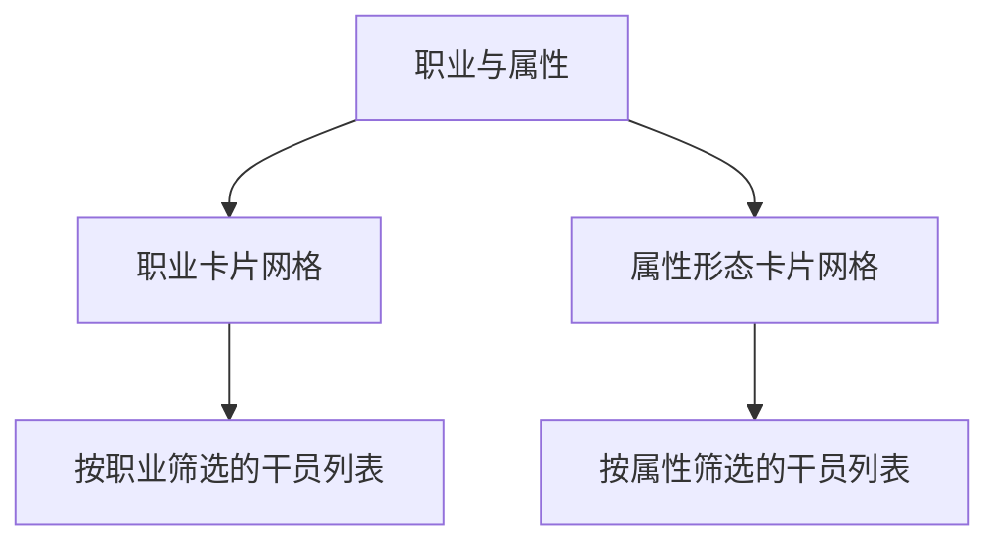

# 职业与属性

职业与属性模块用于说明干员的战斗定位与元素形态，并作为进入对应干员列表的快捷入口。

## 职业

职业决定干员在战斗中的基础定位。当前可查阅的职业包括：

| 职业 | 定位 |
|------|------|
| 近卫 | 近战输出，兼具破防与物理异常能力 |
| 重装 | 高防御，前线承伤 |
| 辅助 | 增益、减益或治疗支援 |
| 术师 | 法术伤害输出 |
| 先锋 | 开局部署与费用相关功能 |
| 突击 | 高机动爆发突袭 |

点击职业卡片可跳转至干员列表，并自动按该职业筛选。

## 属性形态

属性形态决定干员的伤害类型与元素反应倾向。当前可查阅的属性包括：

| 属性 | 主题色 | 关键词 |
|------|--------|--------|
| 寒冷 | 青蓝 | 冰、低温 |
| 灼热 | 橙红 | 火、高温 |
| 电磁 | 金黄 | 电、脉冲 |
| 自然 | 绿 | 生态、自然 |
| 物理 | 灰 | 纯物理 |

点击属性卡片可跳转至干员列表，并自动按该属性筛选。

## 页面结构

## 关联规则

- 每个干员拥有 1 个职业与 1 个属性形态。
- 职业与属性可在干员列表中组合筛选。
- 职业图标与属性颜色作为干员卡片的核心视觉标识。

## 相关文档

- [[20260719-site-concept|站点概念设计]]
- [[20260719-operator-archive|干员档案]]
