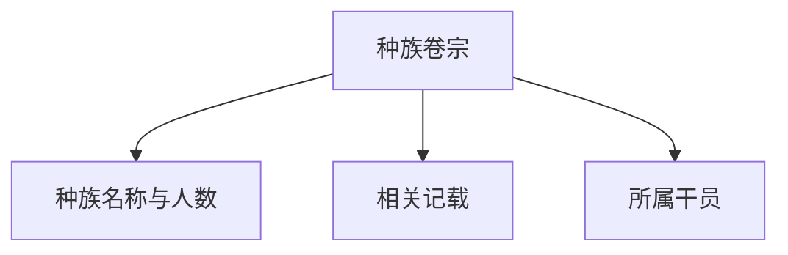

# 干员种族

干员种族模块整理塔卫二上的智慧种族信息。种族数据沿用自游戏内标签体系。

## 种族列表

列表页以卡片网格展示所有有种族标签的种族，每张卡片显示：

- 种族名称
- 该种族下的干员数量
- 若干该种族干员的小头像预览

点击卡片进入种族卷宗。

## 种族卷宗

卷宗页展示单个种族的详细信息：

### 相关记载

通过全文检索能力，搜索种族名称在游戏文本中的出现位置，展示：

- 来源卷宗/数据表
- 包含该种族名称的原文片段
- 种族名称高亮

这帮助管理员快速了解该种族在哪些文献、对话或描述中被提及。

### 所属干员

以干员卡片网格展示该种族下的全部干员，点击可进入干员卷宗。

## 已知种族示例

- 鲁珀、菲林、萨科塔、狐、乌萨斯、库兰塔、卡特斯、黎博利、佩洛、龙、麒麟、萨卡兹等。
- 部分干员种族标记为「保密」或「未知」。

## 关联入口

- 干员卷宗中的种族字段可跳转至对应种族卷宗。
- 种族卷宗中的干员卡片可跳转至干员卷宗。

## 相关文档

- [[20260719-site-concept|站点概念设计]]
- [[20260719-operator-archive|干员档案]]
- [[20260719-factions|干员阵营]]
