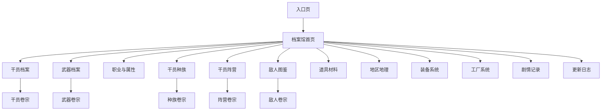

# 宏山档案局概念设计

## 站点定位

宏山档案局是《明日方舟：终末地》的第三方资料集成站点，面向管理员整理塔卫二上已经公开或可查阅的档案信息。

- **调阅者**：终末地管理员
- **内容来源**：游戏内数据与文本
- **核心价值**：准确、结构化、可追溯、官方感

## 信息架构

档案馆按主题划分为若干卷宗，每卷聚焦一类信息实体。



当前已开放的卷宗：干员、武器、职业与属性、种族、阵营、敌人、道具材料、剧情记录、更新日志。

## 全局导航

- 左侧边栏固定展示档案馆 Logo 与各卷宗入口。
- 面包屑记录当前翻阅路径，支持点击返回上级。
- 页脚展示站点名称与数据来源说明。

## 设计语言

档案局采用深色卷宗风格，以沉墨黑为底、象牙白为正文、沉金为强调、印章红为辅助，强调官方感、秩序性与长时间阅读舒适度。

### 设计 Token

```css
--color-archive-ink: #0A0A0D;      /* 主背景、页面底 */
--color-archive-file: #13141A;     /* 卡片、面板、卷宗背景 */
--color-archive-border: #2A2B35;   /* 细边框、分隔线 */
--color-archive-ivory: #E8E6E3;    /* 主文字、标题 */
--color-archive-dust: #8B8982;     /* 次要文字、说明 */
--color-archive-lead: #5A5A62;     /* 弱提示、禁用态 */
--color-archive-gold: #B89A6A;     /* 强调色、链接、hover、徽章 */
--color-archive-seal: #9E3A3A;     /* 印章红、删除/危险 */
--color-archive-bronze: #5A7A6A;   /* 青铜绿、新增/次要强调 */
```

### 字体

| 用途 | 字体 | 说明 |
|------|------|------|
| 标题/卷宗名 | Noto Serif SC | 衬线字体，营造官方档案仪式感 |
| 正文/数据 | Noto Sans SC | 无衬线字体，保证长时间阅读清晰度 |
| 编号/版本 | JetBrains Mono | 等宽字体，用于卷宗编号、模板 ID |

### 布局原则

- 响应式网格，桌面端多列、平板中列、移动端单列。
- 卡片使用细边框与略亮背景，hover 时边框变为沉金透明 40%。
- 列表页标题区展示模块编号（如 `HSA-OPR`），建立档案秩序感。

## 通用页面模板

### 列表页

用于条目较多的卷宗。顶部提供搜索、筛选、排序与分组控件，主体以卡片网格展示条目，支持分页或全部展示。

### 卷宗页

用于单条目的详细查阅。通常包含：

- 顶部概览区（名称、头像/立绘、关键属性、标签）
- 中部数据面板（数值、技能、材料等）
- 底部关联内容（所属分类、相关记载、同类推荐）

### 总览页

用于概念性入口。以卡片网格或关系图引导用户进入下一级列表，并提供快捷跳转。

## 多语言支持

档案局支持简中、繁中、英语、日语、韩语、俄语等多种界面语言，用户可在侧边栏切换。文本内容优先展示当前所选语言，缺失时回退至默认文本。

## 相关文档

- [[20260719-operator-archive|干员档案]]
- [[20260719-weapon-archive|武器档案]]
- [[20260719-profession-element|职业与属性]]
- [[20260719-races|干员种族]]
- [[20260719-factions|干员阵营]]
- [[20260719-enemies|敌人图鉴]]
- [[20260719-items-materials|道具材料]]
- [[20260719-updates|更新日志]]
