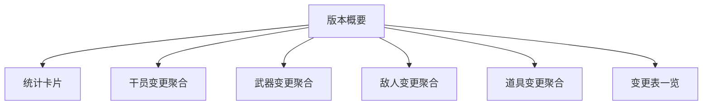

# 更新日志

更新日志模块记录游戏数据在不同版本之间的变化，帮助管理员追踪干员、武器、敌人、道具等内容的调整。

## 版本首页

版本首页列出所有可查看的版本对，每张卡片展示：

- 版本名称
- 生成时间
- 版本描述
- 变更表数量

点击卡片进入该版本的变更概要页。

## 版本概要页

概要页展示单次版本更新的整体变化：

### 统计卡片

展示本次版本中：

- 新增条目数
- 移除条目数
- 变更条目数

### 变更聚合面板

按业务领域聚合相关数据表的变更，减少管理员在多个表之间切换的成本：

- **干员变更**：聚合角色、成长、技能、基建、潜能天赋等相关变更。
- **武器变更**：聚合武器基础数据与相关技能变更。
- **敌人变更**：聚合敌人显示信息、模板、属性与分布变更。
- **道具变更**：聚合物品数据与相关配置变更。

每个聚合卡片展示：

- 该领域变更条目数
- 关键字段的 old → new 对比
- 新增内容的完整展示
- 移除内容的标记

### 变更表一览

列出本次版本所有发生变更的数据表，按变更数量排序。支持「显示全部」展开完整列表，点击表名可进入表级差异页。

## 表级差异页

展示单个数据表在版本间的详细差异：

- 新增条目
- 移除条目
- 变更条目

对于变更条目，按字段路径展示：

- 普通字段变更：旧值与新值并排对比
- 文本字段变更：按语言展示旧文本到新文本的变化，并支持富文本差异高亮

## 差异高亮规则

- 仅高亮文本中实际发生变化的部分。
- 公共前缀与后缀保持正常渲染，保留超链接、颜色等富文本样式。
- 新增内容标记为蓝色边框与「新增」徽章。

## 相关文档

- [[20260719-site-concept|站点概念设计]]
