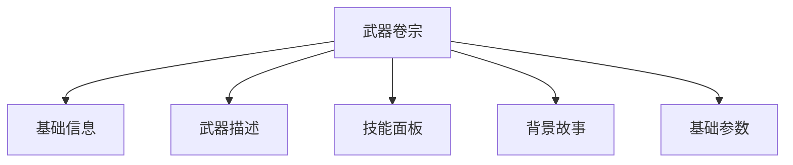

# 武器档案

武器档案收录终末地工业体系中的模块化武器，从制式装备到特殊名器均可查阅。

## 翻阅范围

- 武器列表页
- 武器卷宗页

## 武器列表

列表页以卡片形式展示武器，默认按武器类型分组。

每张卡片包含：

- 武器图标
- 名称
- 稀有度色条
- 武器类型
- 技能名称

### 搜索与筛选

| 能力 | 说明 |
|------|------|
| 搜索 | 按名称或 ID 模糊搜索 |
| 类型筛选 | 单手剑、双手剑、长柄武器、施术单元、手铳等 |
| 稀有度 | 按星级过滤 |
| 技能前缀 | 按三个技能槽位的前缀过滤 |

### 排序与分页

- 排序：稀有度、武器类型，支持升序/降序。
- 分页：每页 12 / 24 / 48 / 全部。

## 武器卷宗

卷宗页展示单把武器的完整信息：

### 基础信息

- 武器名称、类型、稀有度
- 武器图标

### 武器描述

- 物品描述：武器的常规说明文本。
- 道具说明：额外的使用或获取说明。

### 技能面板

- 展示武器自带的技能组。
- 提供等级滑动条，切换不同等级下的技能数值与描述。
- 描述中的富文本正常解析。

### 背景故事

以独立区域展示武器的来由、设计理念或传说文本，采用富文本渲染，突出叙事感。

### 基础参数

- 武器 ID
- 最大等级
- 突破模板
- 升级模板

## 关联入口

武器卷宗中的推荐/适配干员可跳转至干员卷宗；材料可跳转至道具提示。

## 相关文档

- [[20260719-site-concept|站点概念设计]]
- [[20260719-operator-archive|干员档案]]
- [[20260719-items-materials|道具材料]]
