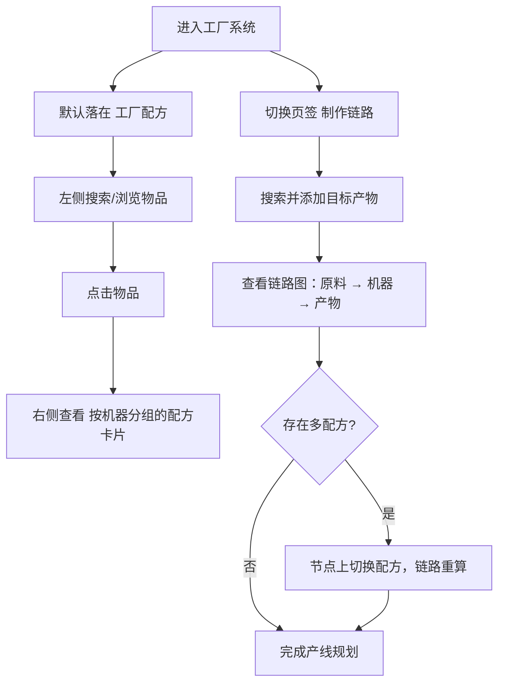

# 工厂系统（工厂配方与制作链路）

> **状态**: 已实现并验收通过（见 [[20260726-factory-acceptance-report|工厂系统验收报告]]，29 项问题全部修复），随 PR #43 待合入 main 后转入 released/。

**功能名称**: 工厂系统 — 工厂配方 & 制作链路
**PRD 版本**: v1.1（按验收报告 §2.8 修订：配方区分组方式由「作为产物/作为材料」改为按机器分组）
**创建日期**: 2026-07-25
**作者**: 产品

## 背景与目标

### 1.1 背景

塔卫二的工厂系统中，管理员需要通过各类机器（精炼炉、粉碎机、灌装机等）将原材料层层加工为目标产物。一条制作链路往往横跨多台机器、多种中间产物，且存在「瓶装/倒空」「种植/采种」等可循环的配方关系。目前档案局的工厂模块仍是占位页，管理员无法：

- 查询某个物品能由哪些配方产出、又能作为哪些配方的材料；
- 了解一个配方需要什么机器、制作耗时与每分钟产能；
- 推演一个目标产物从原料到成品的完整制作链路，规划产线。

### 1.2 目标

- 上线工厂系统，包含「工厂配方」与「制作链路」两个子页面，每个子页面拥有独立地址，可直接访问与分享。
- 「工厂配方」支持以物品为中心的配方查询，选中物品的全部相关配方按机器分组展示。
- 配方以统一的通用配方卡片展示，物品展示遵循全站统一的物品方块语言。
- 「制作链路」支持选择一个或多个目标产物，以图的形式展示完整制作链路，标注所需机器与每分钟数量，并妥善处理循环依赖。

### 1.3 成功标准

- 所有参与机器制造的物品均可检索到其全部相关配方（无论作为材料还是产物）。
- 任一目标产物可推演出完整链路图，链路最终点为所选产物，源头为采集类节点（采矿、泵取等）。
- 存在循环依赖的产物（如瓶装水、种子）链路图正常展示且不陷入无限展开。
- 两个子页面可通过地址栏直接进入，刷新后状态不丢失。

## 用户分析

### 2.1 目标用户

- **核心用户**：规划工厂产线、计算物料平衡的核心玩家。
- **次要用户**：查询「这个材料有什么用」「这个产物怎么做」的资料型用户。

### 2.2 用户场景

| 场景 | 用户角色 | 目标 | 痛点 |
|------|----------|------|------|
| 规划产线 | 核心玩家 | 选定目标产物，看清全链路的机器与每分钟物料流速 | 配方分散，链路需手工推算，循环配方极易算错 |
| 材料用途反查 | 资料用户 | 查某个材料能被哪些配方消耗 | 游戏内无法按材料反查配方 |
| 产物做法查询 | 资料用户 | 查某个产物由什么机器、什么材料制作 | 缺少集中的配方档案 |
| 产能核算 | 核心玩家 | 对比不同配方的每分钟产出/消耗 | 制作时长与数量需要自行换算 |

## 功能需求

### 3.1 功能概述

工厂系统采用「顶部导航 + 页面内容」的切换结构，包含两个子页面：默认子页面「工厂配方」以左右结构提供物品与配方的双向查询；「制作链路」以图的形式推演一个或多个目标产物的完整制作流程。

### 3.2 功能列表

#### 功能点 1: 工厂系统框架与子页面导航

- **描述**: 工厂系统页面由顶部导航与下方内容区组成。顶部导航包含「工厂配方」「制作链路」两个页签，「工厂配方」为默认子页面（进入工厂系统时自动落在该页）。每个子页面拥有独立地址，可直接通过链接访问、刷新与分享；页签切换不触发整页刷新。
- **用户价值**: 用户可以把某个子页面（如某条制作链路）直接分享给他人；导航结构为后续工厂子模块（如机器图鉴）预留扩展位。
- **验收标准**:
  - [ ] 顶部导航包含「工厂配方」「制作链路」两个页签，当前页签有高亮态。
  - [ ] 进入工厂系统默认展示「工厂配方」。
  - [ ] 两个子页面均可通过独立地址直接访问，刷新后停留在对应子页面。
  - [ ] 侧边栏「工厂」入口在任意子页面下均保持高亮。

#### 功能点 2: 工厂配方（默认子页面）

- **描述**: 左右结构布局。左侧为物品列表，收录所有参与机器制造的物品——即至少在一个机器配方中作为材料或作为产物出现的物品；列表项以统一物品方块展示（图标、名称、稀有度），支持按名称搜索。右侧为配方区：点击左侧物品后，按机器分组展示该物品的全部相关配方，每个配方一行（材料在左、箭头标注制作耗时指向产物），选中物品在配方行中高亮；未选中物品时右侧展示引导提示。选中的列表项有高亮态，刷新/分享地址后仍定位到该物品。
- **用户价值**: 以物品为中心一站式查询「怎么来、怎么用」，覆盖资料查询与材料反查两类高频场景。
- **验收标准**:
  - [ ] 左侧列表完整覆盖所有参与机器制造的物品（既含作为材料的，也含仅作为产物的）。
  - [ ] 左侧列表支持按名称搜索过滤。
  - [ ] 点击物品后，右侧按机器分组展示全部相关配方，机器区块含标题行（图标 + 名称 + 配方数量）。
  - [ ] 物品无任何相关配方时，配方区展示空态提示而非缺失。
  - [ ] 选中状态反映在地址中，刷新或分享链接后仍选中同一物品。

#### 功能点 3: 通用配方卡片

- **描述**: 配方以统一的通用配方卡片展示，卡片内的物品一律使用全站统一的物品方块（图标、稀有度、数量角标、点击弹出物品提示）。每张配方卡片包含：
  - 产物区：产物物品方块（含数量），多个产物并列展示；
  - 材料区：材料物品方块（含数量），多个材料并列展示；
  - 所需机器：执行该配方的机器图标与名称；
  - 制作时长：单次制作耗时（秒）；
  - 每分钟产能：按制作时长换算的每分钟产出数量与每分钟材料消耗。
- **用户价值**: 配方信息密度统一、可横向对比；机器与产能信息直接支撑产线规划，无需自行换算。
- **验收标准**:
  - [ ] 配方卡片完整展示产物、材料、所需机器、制作时长与每分钟产能。
  - [ ] 卡片内所有物品以统一物品方块展示，点击可弹出物品提示。
  - [ ] 多材料/多产物的配方完整并列展示，不遗漏。
  - [ ] 同一卡片组件复用于「工厂配方」与「制作链路」中需要展示配方详情的场景。

#### 功能点 4: 制作链路

- **描述**: 用户通过搜索选择一个或多个目标产物，系统以图的形式展示从原料到产物的完整制作链路：
  - 链路方向由原料指向产物，图的最终点（链路汇聚处）为用户选择的产物；选择多个产物时，每个产物都是链路的一个最终汇聚点。
  - 物品节点展示物品方块与每分钟数量（按目标产出的需求速率逐级换算）；
  - 机器节点展示所需机器（图标与名称）；
  - 链路源头为采集类节点（采矿机、流体泵等资源产出设备），标注每分钟采集量；
  - 同一物品存在多个可选配方时，默认使用游戏内推荐（默认）配方展开，用户可在节点上切换配方，链路随之重算；
  - 循环依赖（如瓶装/倒空、种植/采种）不做无限展开：环路以明确的视觉标记（如虚线回边与环标记）提示，链路其余部分正常展示；
  - 已选产物以清单形式展示，可单个移除或清空；选择状态反映在地址中，刷新/分享后还原。
- **用户价值**: 一图看清产线的机器构成与物料流速，直接回答「做这个需要什么机器、每分钟多少个」，循环配方也能安全展示。
- **验收标准**:
  - [ ] 支持搜索并添加一个或多个目标产物。
  - [ ] 链路图以所选产物为最终点，逐级向上游展开至采集类源头。
  - [ ] 图中标注所需机器与各物品的每分钟数量。
  - [ ] 同一物品多配方时可切换配方，链路随之更新。
  - [ ] 循环依赖以视觉标记呈现，不无限展开、不导致页面卡死。
  - [ ] 所选产物清单可移除/清空，且选择状态可通过地址还原。

### 3.3 用户操作流程

### 3.4 页面/界面描述

| 页面 | 描述 | 关键元素 |
|------|------|----------|
| 工厂系统框架 | 顶部导航 + 内容区 | 页签（工厂配方 / 制作链路）、当前页签高亮 |
| 工厂配方 | 左右结构：左物品列表，右配方区 | 物品方块列表、搜索框、按机器分组的配方卡片 |
| 制作链路 | 目标产物选择区 + 链路图 | 产物搜索选择器、已选产物清单、链路图（物品节点、机器节点、每分钟数量、循环标记） |

### 3.5 异常与边界情况

| 情况 | 预期行为 |
|------|----------|
| 物品无任何相关配方 | 配方区展示空态提示 |
| 物品图标/机器图标加载失败 | 显示占位底色，不出现破图 |
| 产物存在循环依赖（如瓶装水、种子） | 环路以视觉标记提示，链路不无限展开 |
| 同一物品存在多个上游配方 | 默认使用游戏内推荐配方，支持手动切换 |
| 液体/气体类物品 | 与固体物品同等展示，参与配方查询与链路推演 |
| 采集类源头物品（矿石、水等） | 链路终止于采集节点，标注每分钟采集量 |
| 未选择任何目标产物 | 链路图区域展示引导提示 |
| 数据加载失败 | 展示错误提示与重试入口，与全站一致 |

## 四、非功能需求

### 4.1 性能要求

- 工厂配方左侧列表（数百个物品）滚动与搜索不卡顿，图片按需加载。
- 链路图在常规链路规模（数十个节点）下渲染与缩放/平移交互流畅。

### 4.2 安全性要求

- 无。

### 4.3 兼容性要求

- 桌面与移动端浏览器均可用：工厂配方在窄屏下左右结构转为上下结构；链路图支持触摸平移缩放，响应式断点与全站一致。

## 五、依赖与约束

### 5.1 依赖

- 既有物品数据与物品提示浮层能力（物品名称、图标、稀有度、描述）。
- 全站统一的物品方块展示语言（见 [[20260722-item-panel|物品组件规范化]]）。

### 5.2 约束

- 本期仅覆盖**机器制造配方**；手工配方、枢纽建造配方、装备配方与飞船/种植舱配方不在本期范围。
- 每分钟产能按配方制作时长换算的理论值展示，不考虑电力、运输等游戏内实际约束。
- 数据为只读档案，不提供产线保存、导出等编辑能力。

## 六、验收结果

**验收日期**: 2026-07-26
**验收报告**: [[20260726-factory-acceptance-report|工厂系统验收报告]]

### 6.1 验收通过情况

| 验证项 | 结果 |
|--------|------|
| `npm run lint` | ✅ 0 errors |
| `npm run test` | ✅ 218 tests passed |
| `npm run build` | ✅ 构建成功 |
| E2E `factory.spec.ts` | ✅ 13/17 passed（连线验证 + 机器节点验证通过，5个失败为预存问题） |

### 6.2 验收问题修复

验收共发现 14 个问题，全部已修复：

| # | 问题 | 根因 | 修复 commit |
|---|------|------|-------------|
| 2.1 | 左侧列表无分页 | 无分页机制 | `b832dc0` |
| 2.2 | 右侧配方无分页 | 无分页机制 | `6d8e5c7` |
| 2.3 | FullBottleTable 重复加载 | 无 in-flight 去重 | `f8fc0c5` + `a79f9f8` |
| 2.4 | ItemTable 重复加载 | 同上 | `a79f9f8` |
| 2.5 | 物品 ID 来源错误 | 依赖外部索引表 | `c860ff0` |
| 2.6 | 配方 ID 永远为空 | adapter 字段名错误 | `3847de7` |
| 2.7 | 数据结构不匹配 | adapter 格式假设错误 | `92e5c0c` |
| 2.8 | 配方展示逻辑错误 | 未按产品文档实现 | `2f785b6` |
| 2.9 | 物品列表排序错误 | 按字母而非稀有度 | `25aeb57` |
| 2.10 | 移动端选择体验差 | 列表始终展开 | `25aeb57` |
| 2.11 | 链路图连线不可见 | ReactFlow 默认 CSS 覆盖边样式 | `a6fdb27` + `2e821ac` |
| 2.12 | 链路页选品 UI 与配方页不一致 | 链路页用搜索弹窗，配方页用侧边栏 | `159ca08` |
| 2.13 | 机器节点缺少名字和图标 | buildChainGraph 未传入 machines 数据 | `769a3b7` |
| 2.14 | 机器图标资源路径错误 | 使用 itemicon/ 而非 buildingpanelicon/ | `0cf0ef6` |

### 6.3 验收后改进项

验收过程中识别的改进方向（已纳入二期规划）：

- 图结构改为以机器节点为中心，显示机器台数与物流需求
- 支持多目标产物 + 可调产速
- 新增传送带/管道数量展示
- 完善循环规则（区分有效循环与封闭回路）
- 供应瓶颈计算（实际产出 = min(理论产出, 上游供应)）

详见 [[20260726-factory-chain-v2|制作链路图 v2 PRD]]。

## 七、相关文档

- [[20260719-site-concept|站点概念设计]]
- [[20260719-items-materials|道具材料]]
- [[20260722-item-panel|物品组件规范化]]
- [[20260719-placeholders|占位模块]]
- [[20260726-factory-chain-v2|制作链路图 v2 PRD]]
- [[20260726-factory-chain-v2|制作链路图 v2 技术方案]]
- [[20260726-factory-chain-v2-plan|制作链路图 v2 实现方案]]
