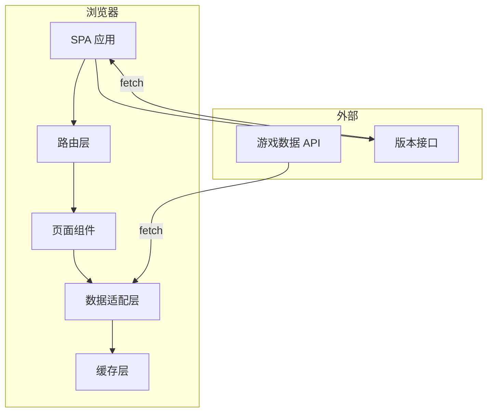
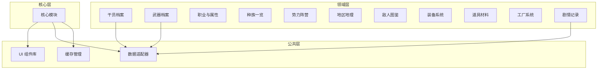
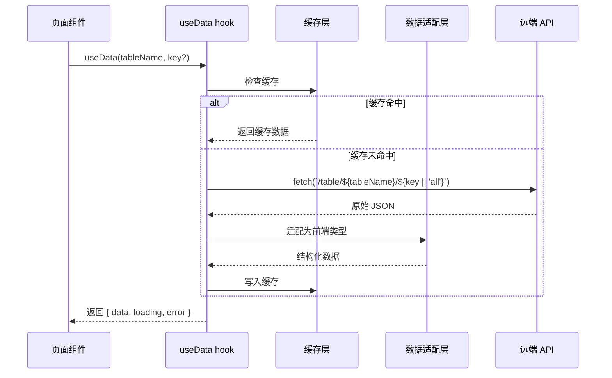
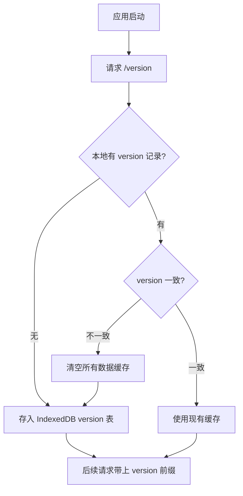

# 宏山档案馆 - 技术提案

**功能名称**: 宏山档案馆前端应用
**关联 PRD**:
  - [[00-site-concept|站点概念设计]]
  - [[01-operator-archive|干员档案]]
  - [[02-weapon-archive|武器档案]]
  - [[03-profession-element|职业与属性]]
  - [[04-races|种族一览]]
  - [[05-factions|势力阵营]]
  - [[06-geography|地区地理]]
  - [[07-bestiary|敌人图鉴]]
  - [[08-equipment|装备系统]]
  - [[09-items-materials|道具材料]]
  - [[10-factory|工厂系统]]
  - [[11-story-archive|剧情记录]]
**技术提案版本**: v1.0
**创建日期**: 2026-07-13
**feat-branch**: `feat/hongshan-archives`

## 1. 概述

### 1.1 背景

宏山档案馆是一个《明日方舟：终末地》粉丝向资料站，以静态 SPA 形式呈现。所有数据来自公开的游戏数据 API（`https://endfield-assets.fffdan.com/`，完整接口定义见 `openapi/v1.json`），无需自建后端。

### 1.2 目标

- 实现 11 个分类模块的列表与详情翻阅
- 从远端 API 获取游戏数据并在本地缓存
- 支持干员档案、武器档案、种族、势力、地理、敌人、装备、道具、工厂、剧情等全模块
- 响应式设计，桌面与移动端均可使用

### 1.3 范围

**做**：
- 入口页 → 档案馆首页 → 各模块列表页 → 卷宗详情页 的完整路由
- 基于 `react-router` 的客户端路由
- 数据适配层（Adapter）：将原始 API 响应映射为前端消费类型
- 本地缓存策略（IndexedDB + 内存 LRU）
- 筛选与分类浏览
- 标签系统跨模块关联

**不做**：
- 不建后端，不建数据库
- 不做用户系统
- 不做社区贡献/编辑功能
- 不做全文检索

## 2. 技术架构

### 2.1 系统架构图



### 2.2 技术栈

| 层级 | 技术选型 | 说明 |
|------|---------|------|
| 框架 | React 19 + TypeScript ~6.0 | — |
| 构建 | Vite 8 | — |
| 路由 | react-router v7 | 客户端路由 |
| 样式 | Tailwind CSS v4 | 工具类优先 |
| 数据获取 | fetch + 自定义 hooks | 无外部请求库 |
| 缓存 | IndexedDB + Map（内存 LRU） | 持久化+运行时 |
| 状态管理 | React hooks（useState/useReducer/useContext） | 无外部状态库 |

### 2.3 模块划分



| 模块 | 职责 | 关键技术点 |
|------|------|-----------|
| 核心模块 | 路由定义、布局骨架、全局状态 | react-router loaders |
| 数据适配层 | 将 API 原始 JSON 映射为前端类型 | TypeScript 类型守卫 |
| 缓存管理 | 请求去重、过期控制、持久化 | LRU Map + IndexedDB |
| UI 组件库 | 卡片、列表、筛选栏、标签页、面包屑 | Tailwind 原子化 |
| 领域模块 | 各分类的列表/筛选/详情页面 | 按 product doc 设计 |

## 3. 路由设计

### 3.1 路由表

| 路径 | 页面 | 对应模块 |
|------|------|---------|
| `/` | 入口页（Landing） | 00-site-concept |
| `/archive` | 档案馆首页 | 导航总览 |
| `/archive/operators` | 干员列表 | 01-operator-archive |
| `/archive/operators/:id` | 干员卷宗 | 01-operator-archive |
| `/archive/weapons` | 武器列表 | 02-weapon-archive |
| `/archive/weapons/:id` | 武器卷宗 | 02-weapon-archive |
| `/archive/professions` | 职业与属性总览 | 03-profession-element |
| `/archive/races` | 种族一览 | 04-races |
| `/archive/races/:id` | 种族卷宗 | 04-races |
| `/archive/factions` | 势力阵营总览 | 05-factions |
| `/archive/factions/:id` | 势力卷宗 | 05-factions |
| `/archive/geography` | 地区列表 | 06-geography |
| `/archive/geography/:id` | 地区卷宗 | 06-geography |
| `/archive/enemies` | 敌人列表 | 07-bestiary |
| `/archive/enemies/:id` | 敌人卷宗 | 07-bestiary |
| `/archive/equipment` | 装备系统总览 | 08-equipment |
| `/archive/items` | 道具列表 | 09-items-materials |
| `/archive/items/:id` | 道具卷宗 | 09-items-materials |
| `/archive/factory` | 工厂系统总览 | 10-factory |
| `/archive/story` | 剧情记录总览 | 11-story-archive |
| `/archive/story/:id` | 记录详情 | 11-story-archive |

### 3.2 路由嵌套结构

```
<BrowserRouter>
  <Routes>
    <Route path="/" element={<LandingPage />} />       ← 入口页
    <Route path="/archive" element={<ArchiveLayout />}>  ← 全局布局
      <Route index element={<ArchiveHome />} />         ← 档案馆首页
      <Route path="operators" element={<OperatorList />} />
      <Route path="operators/:id" element={<OperatorDetail />} />
      <!-- ... 其余模块路由 -->
    </Route>
  </Routes>
</BrowserRouter>
```

`ArchiveLayout` 提供顶栏 + 面包屑 + 内容区的页面骨架。

## 4. 数据流设计

### 4.1 数据获取流程



### 4.2 版本锚定

每次打开档案馆时，先请求版本接口获取当前数据版本，以此作为缓存的锚定标识。

**版本接口**：`GET /version`（返回纯文本，如 `initial_8190425-29_main_8190425-29`）

**响应示例**：`initial_8190425-29_main_8190425-29`

**机制**：



**缓存键格式**：`${version}:${tableName}:${key}`

例如 `initial_8190425-29_main_8190425-29:CharacterTable:chr_0005_chen`。

版本变更时，所有旧键自然失效（按前缀批量清除或整体清库）。

### 4.3 缓存策略

| 层级 | 实现 | 容量 | 过期 |
|------|------|------|------|
| 内存（运行时） | `Map<string, CacheEntry>` | 100 条 LRU | 30 分钟 |
| 持久化（跨会话） | `IndexedDB` | 不限 | 7 天 |
| 预取 | `<link rel="prefetch">` | — | 构建时配置 |

### 4.4 Hook 设计

```typescript
// 核心数据 hook
function useTableData<T>(tableName: string): UseDataResult<T[]>
function useTableEntry<T>(tableName: string, key: string): UseDataResult<T>

// 便捷 hook（封装适配逻辑）
function useOperators(): UseDataResult<Operator[]>
function useOperator(id: string): UseDataResult<Operator>
function useWeapons(): UseDataResult<Weapon[]>
function useEnemies(): UseDataResult<Enemy[]>
// ... 以此类推
```

### 4.5 类型定义示意

```typescript
// 数据适配后的前端类型
interface Operator {
  id: string
  name: string
  race: string
  profession: string
  element: string
  faction: string
  rarity: number
  profileRecords: string[]
  voiceLines: VoiceLine[]
  tags: string[]
}

interface Weapon {
  id: string
  name: string
  type: 'sword' | 'claymore' | 'lance' | 'pistol' | 'funnel'
  rarity: number
  description: string
  lore: string
  skills: string[]
  maxLevel: number
}
```

## 5. 项目结构

```
src/
├── main.tsx                    # 入口
├── App.tsx                     # 路由配置
├── routes/
│   ├── Landing.tsx             # 入口页
│   ├── ArchiveLayout.tsx       # 全局布局（顶栏+面包屑）
│   └── ArchiveHome.tsx         # 档案馆首页
├── pages/
│   ├── operators/
│   │   ├── OperatorList.tsx
│   │   └── OperatorDetail.tsx
│   ├── weapons/
│   │   ├── WeaponList.tsx
│   │   └── WeaponDetail.tsx
│   ├── professions/
│   │   └── ProfessionOverview.tsx
│   ├── races/
│   │   ├── RaceList.tsx
│   │   └── RaceDetail.tsx
│   ├── factions/
│   │   ├── FactionOverview.tsx
│   │   └── FactionDetail.tsx
│   ├── geography/
│   │   ├── GeographyList.tsx
│   │   └── GeographyDetail.tsx
│   ├── enemies/
│   │   ├── EnemyList.tsx
│   │   └── EnemyDetail.tsx
│   ├── equipment/
│   │   └── EquipmentOverview.tsx
│   ├── items/
│   │   ├── ItemList.tsx
│   │   └── ItemDetail.tsx
│   ├── factory/
│   │   └── FactoryOverview.tsx
│   └── story/
│       ├── StoryOverview.tsx
│       └── StoryDetail.tsx
├── components/                 # 通用 UI 组件
│   ├── Layout/
│   │   ├── TopNav.tsx
│   │   ├── Breadcrumb.tsx
│   │   └── Footer.tsx
│   ├── Card/
│   │   ├── OperatorCard.tsx
│   │   ├── WeaponCard.tsx
│   │   └── EnemyCard.tsx
│   ├── FilterBar.tsx
│   ├── Tag.tsx
│   ├── StarRating.tsx
│   ├── ElementIcon.tsx
│   └── ProfessionIcon.tsx
├── hooks/
│   ├── useTableData.ts
│   ├── useOperators.ts
│   ├── useWeapons.ts
│   └── useEnemies.ts
├── lib/
│   ├── cache.ts                # LRU Map + IndexedDB
│   ├── adapter.ts              # 数据适配函数
│   ├── api.ts                  # fetch 封装
│   └── types.ts                # 前端类型定义
├── data/
│   └── constants.ts            # 职业/属性/种族等枚举常量
├── assets/
└── index.css
```

## 6. 关键实现点

### 6.1 数据适配层（Adapter）

远端 API 返回的是原始的 JSON 结构，字段名和结构与前端所需不同。每个领域模块需要一个适配函数：

```typescript
// lib/adapter.ts
function adaptOperator(raw: any): Operator {
  return {
    id: raw.characterId ?? raw.$id,
    name: raw.name?.text ?? '',
    race: raw.raceTag?.tagId?.replace('tag_race_', '') ?? '',
    profession: String(raw.profession ?? ''),
    element: raw.charType ?? '',
    faction: raw.factionTag?.tagId?.replace('tag_power_', '') ?? '',
    rarity: raw.rarity ?? 0,
    profileRecords: (raw.profileRecord ?? []).map((r: any) => r.recordDesc?.text ?? ''),
    voiceLines: (raw.profileVoice ?? []).map((v: any) => ({
      title: v.voiceTitle?.text ?? '',
      text: v.voiceDesc?.text ?? '',
    })),
    tags: Object.values(raw.tagDesc ?? {}).map((t: any) => t.desc?.text ?? ''),
  }
}
```

### 6.2 缓存层

```typescript
// lib/cache.ts
interface CacheEntry<T> {
  data: T
  timestamp: number
  ttl: number
}

let currentVersion: string | null = null

// 应用启动时调用
async function initCache(): Promise<string> {
  const res = await fetch('https://endfield-assets.fffdan.com/version')
  const version = await res.text()
  const old = await persistentCache.get<string>('_version')
  if (old && old !== version) {
    await persistentCache.clearAll()   // 版本变了，清空整个缓存库
  }
  await persistentCache.set('_version', version)
  currentVersion = version
  return version
}

function cacheKey(table: string, key?: string): string {
  return `${currentVersion}:${table}${key ? ':' + key : ''}`
}

// 内存缓存：运行时快速读写
class MemoryCache {
  private store: Map<string, CacheEntry<unknown>>
  private maxSize: number

  get<T>(key: string): T | null
  set<T>(key: string, data: T, ttl?: number): void
  invalidate(pattern?: string): void
}

// 持久化缓存：IndexedDB，跨会话保留
class PersistentCache {
  private dbName = 'HongshanArchives'
  private storeName = 'cache'
  private db: IDBDatabase | null = null

  async open(): Promise<void>
  async get<T>(key: string): Promise<T | null>
  async set<T>(key: string, data: T, ttl?: number): Promise<void>
  async clearAll(): Promise<void>
}
```

读写策略：优先查内存缓存（LRU Map），未命中则查 IndexedDB，命中后回填内存；写入时同时写入两者。应用启动时只从 IndexedDB 按需加载，不预填全部数据到内存。

### 6.3 入口页淡出过渡

```typescript
// 使用 CSS transition 实现
const [entered, setEntered] = useState(false)
// 点击按钮后设置 entered=true → 触发 opacity 过渡
// 过渡结束后通过 react-router navigate 跳转
```

首次访问标记：`localStorage.setItem('hasVisited', 'true')`；但游戏数据缓存走 IndexedDB。

### 6.4 筛选栏设计

```typescript
// 通用筛选状态
interface FilterState {
  profession?: string
  element?: string
  race?: string
  faction?: string
  rarity?: number
}

// 通过 URL search params 持久化筛选状态
// /archive/operators?profession=5&element=Fire
```

## 7. 技术决策

### 7.1 决策列表

| 决策 | 选项 A | 选项 B | 最终选择 | 原因 |
|------|--------|--------|---------|------|
| 状态管理 | useContext + useReducer | Zustand | useContext | 项目小，无需外部库 |
| 数据获取 | fetch + 手写 hooks | React Query / SWR | 手写 hooks | 减少依赖，控制缓存逻辑 |
| 路由 | react-router v7 | TanStack Router | react-router v7 | 生态成熟 |
| 样式方案 | Tailwind CSS v4 | CSS Modules | Tailwind CSS v4 | 已配置 |

### 7.2 依赖与约束

| 类型 | 内容 | 说明 |
|------|------|------|
| 约束 | 不引入外部状态管理库 | 保持 bundle 轻量 |
| 约束 | 不建后端 | SPA + 外部 API |
| 依赖 | react-router | 路由方案 |
| 依赖 | 远端 API 可用性 | 数据全依赖 `fffdan.com` |

## 8. 项目结构

同上第 5 节。

## 9. 测试策略

### 9.1 测试覆盖要求

- 适配函数单元测试：100% 核心字段覆盖
- 缓存层单元测试：命中/未命中/过期/LRU 淘汰
- 组件测试：每个页面组件至少一个渲染测试

### 9.2 测试类型

| 类型 | 工具 | 覆盖范围 |
|------|------|---------|
| 单元测试 | Vitest | 适配器、缓存、hooks |
| 组件测试 | Vitest + happy-dom | 页面组件 |
| E2E | 暂不覆盖 | 后续迭代 |

## 10. 部署方案

### 10.1 环境规划

| 环境 | 用途 | 部署方式 |
|------|------|---------|
| production | 正式站点 | Vite build → static hosting（GitHub Pages / Vercel） |

### 10.2 构建输出

```
dist/
├── index.html
├── assets/
│   ├── index-xxx.js
│   └── index-xxx.css
└── 404.html              # SPA fallback
```

## 11. 验收标准

- [x] 技术方案评审通过
- [ ] 路由配置完成，11 个模块均可导航
- [ ] 数据适配层覆盖 11 个模块的核心字段
- [ ] 缓存层实现 LRU（内存）+ IndexedDB 双级缓存
- [ ] 入口页过渡效果正常
- [ ] 筛选栏在各列表页正常工作
- [ ] 响应式布局，移动端底部导航可用
- [ ] 已访问用户跳过入口页

## 相关卷宗

- [[00-site-concept|站点概念设计]]
- 各模块 product doc（01-11）
